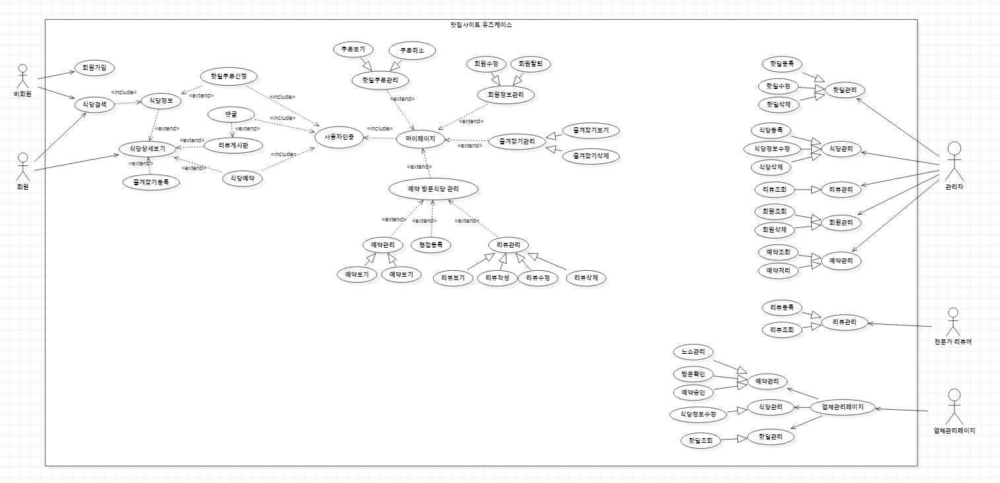
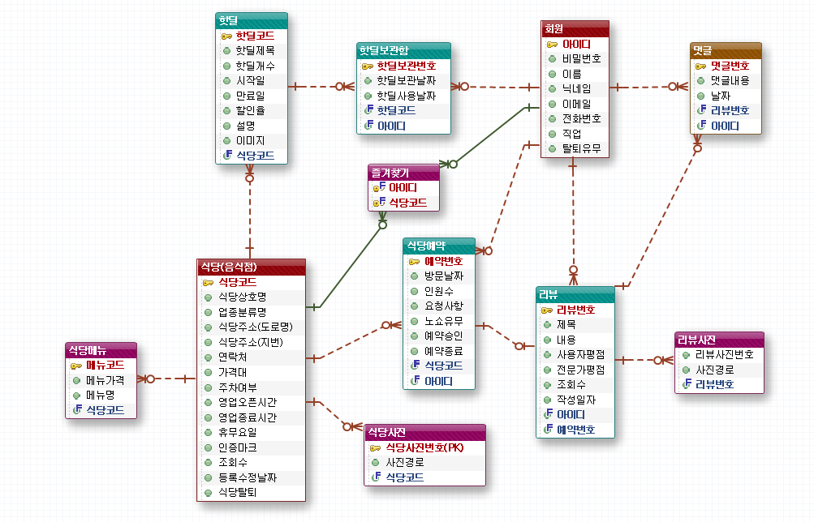

[메인으로 이동](../../../README.md)

# 📒 맛집소개사이트 Use case, ERD 설계

## 📖 소개 <a id="aid-1">

- 맛집소개사이트 Use case, ERD 설계
- 수업일: 21-11-09

## 📖 목차 <a id="aid-2">

1. [소개](#aid-1)
1. [목차](#aid-2)
1. [Use case 설계](#aid-3)
1. [ERD 설계](#aid-4)

## 📖 Use case 설계 <a id="aid-3">

### Use Case 시나리오 작성 

Actor

- 비회원
- 회원
- 관리자
- 전문가 리뷰어
- 업체 관리자

비외원 관점에서 Use Case

- 회원가입
- 식당검색 <<include>> 식당정보
- 식당정보 <<extend>> 식당상세보기

회원 관점에서 Use Case

- 식당검색
- 식당상세보기 <<extend>> 즐겨찾기등록
- 식당상세보기 <<extend>> 식당예약
- 식당예약 <<include>> 사용자인증
- 식당상세보기 <<extend>> 핫딜쿠폰신청
- 핫딜쿠폰신청 <<include>> 사용자인증
- 식당상세보기 <<extend>> 리뷰게시판
- 리뷰게시판 <<extend>> 댓글
- 댓글 <<include>> 사용자인증

- 사용자인증 <<include>> 마이페이지
- 핫딜쿠폰관리 <<extend>> 마이페이지
- 회원정보관리 <<extend>> 마이페이지
- 즐겨찾기관리 <<extend>> 마이페이지
- 예약/방문식당 관리 <<extend>> 마이페이지
- 예약/방문식당 관리 <<extend>> 예약관리
- 예약/방문식당 관리 <<extend>> 평점등록
- 예약/방문식당 관리 <<extend>> 리뷰관리

관리자 관점에서 Use Case

- 핫딜관리 ⇒ 핫딜등록, 핫딜수정, 핫딜삭제
- 식당관리 ⇒ 식당등록, 식당정보수정, 식당삭제
- 리뷰관리 ⇒ 리뷰조회
- 회원관리 ⇒ 회원조회, 회원삭제
- 예약관리 ⇒ 예약조회, 예약처리

전문가 리뷰어 관점에서 Use Case

- 리뷰관리 ⇒ 리뷰등록, 리뷰조회

업체관리자 관점에서 Use Case

- 업체관리페이지
    - 예약관리 ⇒ 노쇼처리, 방문확인, 예약승인
    - 식당관리 ⇒ 식당정보수정
    - 핫딜관리 ⇒ 핫딜조회

### Use Case 작성

[목차로 이동](#aid-2)

## 📖 ERD 설계 <a id="aid-4">

### Use Case로부터 개체 및 속성 발견

개체(Entity)

- 회원가입
- 핫딜보관함
- 식당(음식점) ⇒ 보스 객체(중심) 센터로
- 식당예약
- 식당메뉴
- 식당사진
- 핫딜
- 즐겨찾기
- 리뷰게시판
- 댓글
- 리뷰사진

개체에 속성 발견

- 회원가입: 아이디(PK), 비밀번호, 이름, 닉네임, 이메일, 전화번호, 직업, 탈퇴유무
- 핫딜보관함: 핫딜보관번호(PK), 핫딜보관날짜, 핫딜사용날짜
- 식당(음식점): 식당코드(PK), 식당상호명, 업종분류명, 식당주소(도로명), 식당주소(지번), 연락처, 가격대, 주차여부, 영업오픈시간, 영업종료시간, 휴무요일, 인증마크, 조회수, 등록수정날짜, 식당탈퇴
- 식당예약: 예약번호(PK), 방문날짜, 인원수, 요청사항, 노쇼유무, 예약승인, 예약종료
- 식당메뉴: 메뉴코드(PK), 메뉴명, 메뉴가격
- 식당사진: 식당사진번호(PK), 사진경로
- 핫딜: 핫딜코드(PK), 핫딜제목, 핫딜개수, 시작일, 만료일, 할인율, 핫딜설명, 핫딜이미지
- 즐겨찾기: (식당과 회원가입 개체 간의 관계로 만들어지는 관계 테이블이다. 기본엔티티가 아닌.)
    - '회원가입'과 '식당' 개체 관계에 의해서 만들어지는 관계 개체
- 리뷰게시판: 리뷰번호(PK), 제목, 글내용, 유저평점, 전문가평점, 조회수, 작성일자
- 댓글: 댓글번호(PK), 댓글내용, 날짜
- 리뷰사진: 리뷰사진번호(PK), 사진경로

### ERD 작성

[목차로 이동](#aid-2)

[메인으로 이동](../../../README.md)