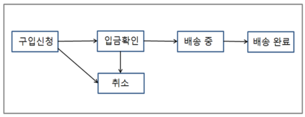
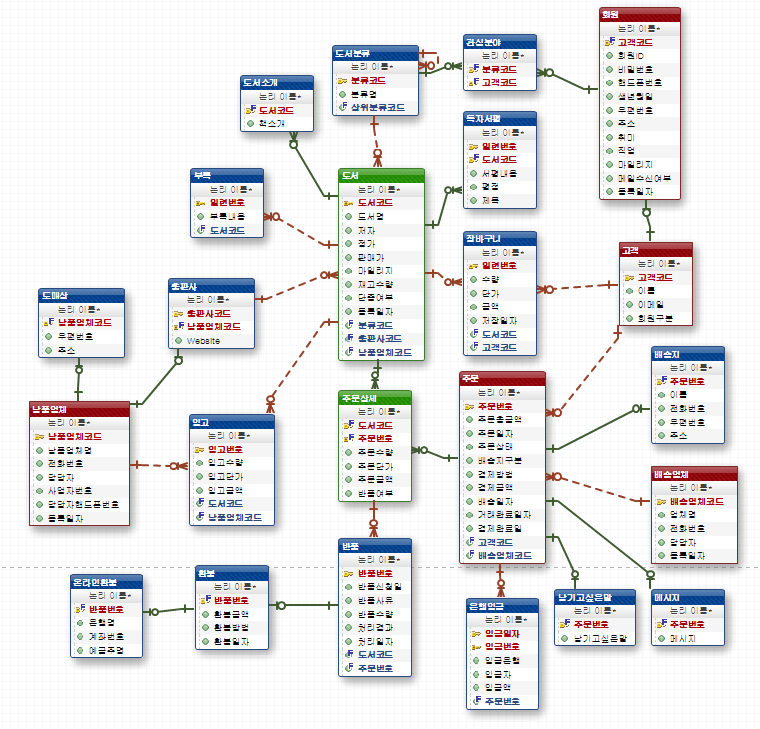
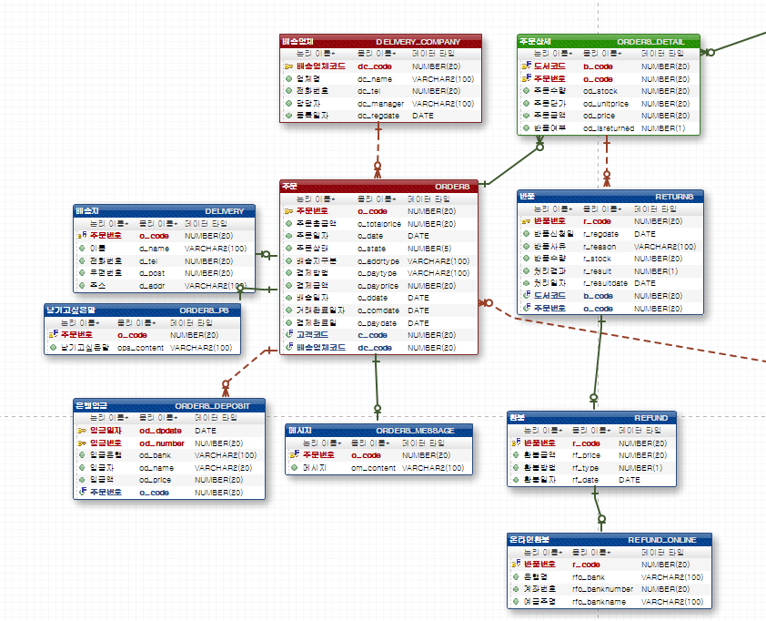
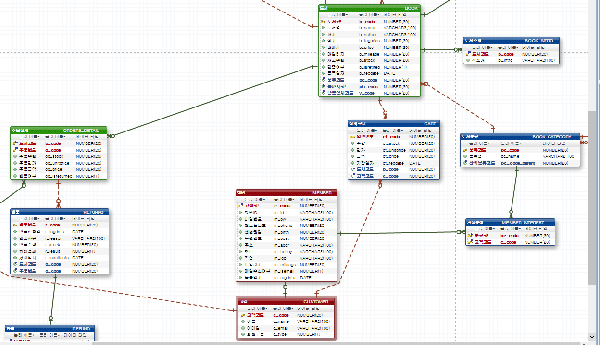
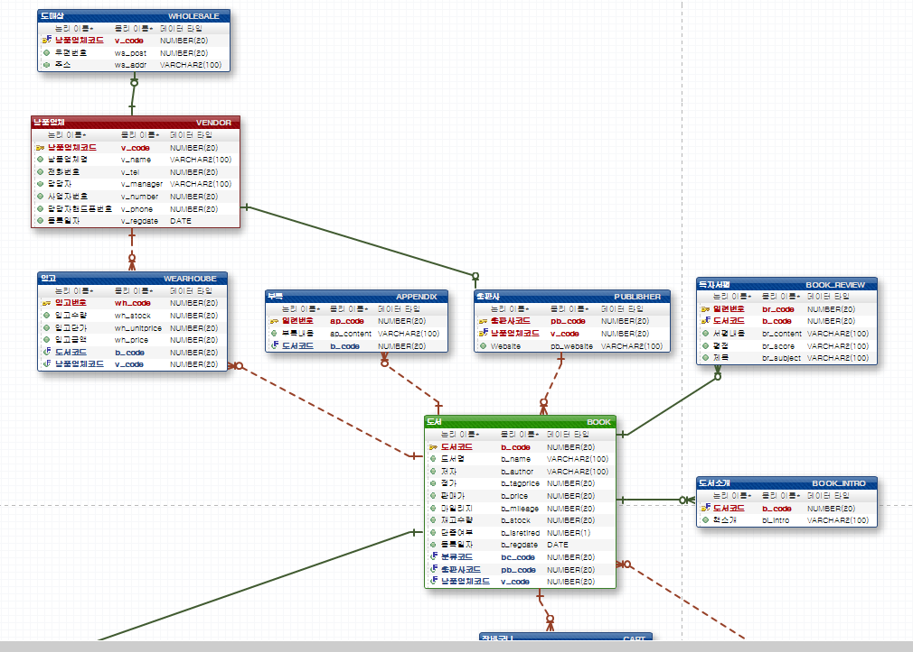

[메인으로 이동](../../../README.md)


# 📒 인터넷 서점 쇼핑몰 ERD 모델링 설계

## 📖 소개

- 인터넷 서점 쇼핑몰 업무분석 후 ERD 모델링 설계
- 수업일: 21-11-05, 21-11-08

## 📖 목차 <a id="aid-index">

1. [📖 업무분석](#aid-1)
1. [📖 개체(Entity)](#aid-2)
1. [📖 ERD](#aid-3)
1. [📖 SQL](#aid-4)

## 📖 업무분석 <a id="aid-1">


### 1. 고객 관리

1) 고객은 인터넷을 통해 회원가입을 한 회원과 그렇지 않은 비회원으로 나뉘며 회원과 비회원 모두 인터넷을 통해 서적을 구매할 수 있다.

회원인 경우는 회원ID, 비밀번호, 이름, 성별, 생년월일, 핸드폰번호, 이메일, 메일수신여부, 우편번호, 주소, 직업, 취미 등등의 기본 정보를 관리한다.

비회원인 고객이 도서를 주문할 때는 주문하는 사람의 이름, 핸드폰번호, 이메일 등을 관리하며 수신하는 사람의 필요한 정보 또한 관리한다.

2) 회원이 도서를 구매할 경우 각 상품에 대한 일정액의 마일리지를 부여하여 추후 주문 시 현금과 같이 사용할 수 있도록 한다.

3) 회원들의 관심분야를 체크해서 이메일로 신간 서적들에 대한 정보를 제공한다.

### 2. 도서 관리

1) 도서는 분류에 따라 컴퓨터, 경영, 경제, 심리학, 철학, 어학, 문학 등등으로 크게 분류하며 각각의 분류 항목에 따른 세부적인 분류 항목들이 체계적으로 관리한다.

2) 인터넷을 통해 고객이 도서에 대한 정보를 볼 수 있도록 도서명, 저자, 정가, 출판사, 할인율, 판매가, 마일리지, 출판일, 책 소개 등의 정보를 관리한다. 각 도서에 대한 단종 여부와 도서가 남아 있지 않은 경우는 공급업체에 연락해 도서를 공급받기 위해 재고 현황 파악이 가능해야 한다.

3) 책에 대한 공급은 기본적으로 출판사와 직거래를 하고 있으며 필요에 따라 급한 경우에는 중간 도매상에서도 책을 일부 공급 받는다.

### 3. 관심분야 관리

1) 한 명의 회원은 여러 개의 분야에 관심을 가질 수 있고 하나의 분야는 여러 회원들이 관심을 가질 수 있으므로 이 둘은 다 대 다 관계이다. 그러므로 서적분류 개체와 회원 개체는 다 대 다 관계를 해소해서 교차 실체(식별 관계)를 추가하면 각각의 회원들에 대한 관심분야를 정의할 수 있다.

### 4. 주문 관리

1) 결제 정보

결제 방법은 신용카드, 온라인 입금, 마일리지 이용 등의 세 가지 방법이 있다. 신용 카드일 경우는 승인 정보만을 관리하지만 온라인 입금일 경우 입금자와 입금일자, 입금금액 그리고 은행명 등을 입력 받는다. 결제가 완료되면 결제금액, 결제일 등을 관리한다.

2) 배송 정보

고객이 주문을 할 경우 배달을 받는 사람의 이름, 핸드폰번호, 우편번호, 주소를 입력 받는다. 그리고 배송을 위해 배송업체 정보도 관리하며 주문 총금액이 3만원 미만인 경우는 배송료를 추가로 받는다.

각 주문에 대한 처리 상태는 다음과 같이 관리한다.



위와 같이 고객이 어떤 도서를 주문했을 경우에는 두 가지 프로세스가 발생되는데 우선 정상적인 경우라면 “구입신청 -> 입금확인 -> 배송 중 -> 배송 완료” 단계를 거치게 될 것이다. 즉 고객이 어떤 도서를 주문한 후 주문 총금액을 입금한 경우에만 배송 처리가 진행이 될 것이다.

또한 주문에 대한 취소는 주문 상태가 구입신청, 입금확인 단계에서는 가능하지만 배송 중, 배송 완료 후에는 취소가 불가능하다. 배송을 시작한 이후에 취소를 하려면 반품이나 환불을 해야 한다.

### 5. 납품업체 관리

1) 일반적으로 서적은 출판사로부터 직접 납품을 받지만 때로는 출판사에도 없는 책이 있을 수 있다. 그러면 주문을 받았기 때문에 배송을 해주어야 하는데 출판사에서 다시 책을 찍어내는데 3~4일이 걸린다고 하면 쇼핑몰을 운영하는 입장에서는 중간 도매상에서라도 책을 가져와서 바로 배송을 해주어야 한다.

### 6. 반품 관리

1) 반품을 하는 경우 재배송을 요청하는 경우와 환불을 요청하는 경우가 있을 수 있으며 재배송을 요청하는 경우 ‘재배송 일자’를 정의해 주면 된다.

### 7. 배송지 관리

1) 우선 주문에 따른 배송지를 정의해야 하기 때문에 배송지 개체는 주문 개체의 자식 개체로 관계를 맺고 있다.

2) 회원인 경우에 두 가지 경우의 수가 있는데 회원이 자신의 기본적인 회원 정보를 이용하여 배송지를 정의할 수 있고, 아니면 다른 사람에게 선물을 하거나 자신의 회원 정보에 기술된 주소와는 다른 곳으로 배송지를 정의할 수 있다.

3) 비회원인 경우에는 무조건 주문에 따른 배송지를 정의해 주어야 한다.


[목차로 이동](#aid-index)

## 📖 개체(Entity) <a id="aid-2">


### 개체(Entity) 발견 및 속성

- 도서분류: 분류코드(PK), 분류명
- 도서: 도서코드(PK), 도서명, 저자, 정가, 판매가, 마일리지, 재고수량, 단종여부, 등록일자
- 장바구니: 일련번호(PK), 수량, 단가, 금액, 저장일자
- 회원: 회원 ID, 비밀번호, 핸드폰번호, 생년월일, 우편번호, 주소, 취미, 직업, 마일리지, 메일수신여부, 등록일자
- 고객: 고객코드(PK), 이름, 연락처, 이메일, 주민번호, 회원구분
- 관심분야: 도서분류와 회원 개체에 의해서 만들어지는 테이블 ⇒ 분류코드(FK), 회원번호(FK)
- 주문: 주문번호(PK), 주문일자, 주문총금액, 주문상태, 배송지구분, 배송구분, 결제방법, 결제금액, 배송일자, 거래완료일자, 결제완료일
- 주문상세: 주문수량, 주문단가, 주문금액, 반품여부
- 부록: 일련번호, 부록내용
- 출판사: 출판사코드, Website
- 납품업체: 납품업체코드(PK), 납품업체명, 전화번호, 담당자, 사업자번호, 담당자핸드폰번호, 등록일자
- 도매상: 우편번호, 주소
- 입고: 입고번호(PK), 입고일자, 입고수량, 입고단가, 입고금액
- 독자서평: 일련번호, 서평내용, 평점, 제목
- 도서소개: 도서소개
- 반품: 반품번호(PK), 반품신청일, 반품사유, 반품수량, 처리결과, 처리일자
- 배송지: 이름, 전화번호, 우편번호, 주소
- 배송업체: 배송업체코드(PK), 업체명, 전화번호, 담당자, 등록일자
- 은행입금: (입금일자, 입금번호 복합 PK), 입금은행, 입금자, 입금액
- 환불: 환불금액, 환불방법, 환불일자
- 온라인환불: 은행명, 계좌번호, 예금주명
- 재배송: 재배송일자
- 메시지: 메시지
- 남기고싶은말: 남기고싶은말

### 개체(Entity) 간의 관계 정의

도서분류 : 관심분야: 1 : 다

회원 : 관심분야: 1 : 다

도서분류 : 도서: 1 : 다

도서 : 장바구니: 1 : 다

도서 : 주문상세: 1 : 다

도서 : 부록: 1 : 다

도서 : 독자서평: 1 : 다

도서 : 도서소개: 1 : 다

도서 : 입고: 1 : 다

고객 : 회원: 1 : 1

고객 : 주문: 1 : 다

고객 : 장바구니: 1 : 다

주문 : 배송지: 1 : 1

주문 : 주문상세: 1 : 다

주문 : 은행입금: 1 : 다

주문 : 메세지: 1 : 1

주문 : 남기고싶은말: 1 : 1

주문상세 : 반품: 1: 다

배송업체 : 주문: 1: 다

반품 : 재배송: 1 : 1

반품 : 환불: 1 : 1

환불 : 온라인환불: 1 : 1

납품업체 : 도매상 : 1 : 1

납품업체 : 입고 : 1 : 다

납품업체 : 출판사 : 1 : 1

[목차로 이동](#aid-index)

## 📖 ERD <a id="aid-3">











[목차로 이동](#aid-index)

## 📖 SQL <a id="aid-4">


### 테이블 생성 전 삭제 쿼리

```sql
-- 도서분류
DROP TABLE "BOOK_CATEGORY" CASCADE;

-- 회원
DROP TABLE "MEMBER" CASCADE;

-- 관심분야
DROP TABLE "MEMBER_INTEREST" CASCADE;

-- 도서
DROP TABLE "BOOK" CASCADE;

-- 장바구니
DROP TABLE "CART" CASCADE;

-- 주문상세
DROP TABLE "ORDERS_DETAIL" CASCADE;

-- 주문
DROP TABLE "ORDERS" CASCADE;

-- 부록
DROP TABLE "APPENDIX" CASCADE;

-- 출판사
DROP TABLE "PUBLISHER" CASCADE;

-- 납품업체
DROP TABLE "VENDOR" CASCADE;

-- 도매상
DROP TABLE "WHOLESALE" CASCADE;

-- 입고
DROP TABLE "WEARHOUSE" CASCADE;

-- 독자서평
DROP TABLE "BOOK_REVIEW" CASCADE;

-- 도서소개
DROP TABLE "BOOK_INTRO" CASCADE;

-- 반품
DROP TABLE "RETURNS" CASCADE;

-- 배송지
DROP TABLE "DELIVERY" CASCADE;

-- 배송업체
DROP TABLE "DELIVERY_COMPANY" CASCADE;

-- 은행입금
DROP TABLE "ORDERS_DEPOSIT" CASCADE;

-- 환불
DROP TABLE "REFUND" CASCADE;

-- 온라인환불
DROP TABLE "REFUND_ONLINE" CASCADE;

-- 메시지
DROP TABLE "ORDERS_MESSAGE" CASCADE;

-- 남기고싶은말
DROP TABLE "ORDERS_PS" CASCADE;

-- 고객
DROP TABLE "CUSTOMER" CASCADE;

```

### 테이블 생성 쿼리

```sql
-- 도서분류
CREATE TABLE BOOK_CATEGORY (
	bc_code        NUMBER(20)    NOT NULL, -- 분류코드
	bc_name        VARCHAR2(100) NULL,     -- 분류명
	bc_code_parent NUMBER(20)    NULL      -- 상위분류코드
);

-- 도서분류
ALTER TABLE BOOK_CATEGORY
	ADD
		CONSTRAINT PK_BOOK_CATEGORY -- 도서분류 기본키
		PRIMARY KEY (
			bc_code -- 분류코드
		);

-- 회원
CREATE TABLE MEMBER (
	c_code    NUMBER(20)    NOT NULL, -- 고객코드
	m_id      VARCHAR2(100) NOT NULL, -- 회원ID
	m_pw      VARCHAR2(100) NULL,     -- 비밀번호
	m_phone   NUMBER(20)    NULL,     -- 핸드폰번호
	m_birth   NUMBER(20)    NULL,     -- 생년월일
	m_post    NUMBER(20)    NULL,     -- 우편번호
	m_addr    VARCHAR2(100) NULL,     -- 주소
	m_hobby   VARCHAR2(100) NULL,     -- 취미
	m_job     VARCHAR2(100) NULL,     -- 직업
	m_mileage NUMBER(20)    NULL,     -- 마일리지
	m_isemail NUMBER(1)     NULL,     -- 메일수신여부
	m_regdate DATE          NULL      -- 등록일자
);

-- 회원
ALTER TABLE MEMBER
	ADD
		CONSTRAINT PK_MEMBER -- 회원 기본키
		PRIMARY KEY (
			c_code -- 고객코드
		);

-- 관심분야
CREATE TABLE MEMBER_INTEREST (
	bc_code NUMBER(20) NOT NULL, -- 분류코드
	c_code  NUMBER(20) NOT NULL  -- 고객코드
);

-- 관심분야
ALTER TABLE MEMBER_INTEREST
	ADD
		CONSTRAINT PK_MEMBER_INTEREST -- 관심분야 기본키
		PRIMARY KEY (
			bc_code, -- 분류코드
			c_code   -- 고객코드
		);

-- 도서
CREATE TABLE BOOK (
	b_code      NUMBER(20)    NOT NULL, -- 도서코드
	b_name      VARCHAR2(100) NULL,     -- 도서명
	b_author    VARCHAR2(100) NULL,     -- 저자
	b_tagprice  NUMBER(20)    NULL,     -- 정가
	b_price     NUMBER(20)    NULL,     -- 판매가
	b_mileage   NUMBER(20)    NULL,     -- 마일리지
	b_stock     NUMBER(20)    NULL,     -- 재고수량
	b_isretired NUMBER(1)     NULL,     -- 단종여부
	b_regdate   DATE          NULL,     -- 등록일자
	bc_code     NUMBER(20)    NULL,     -- 분류코드
	pb_code     NUMBER(20)    NULL,     -- 출판사코드
	v_code      NUMBER(20)    NULL      -- 납품업체코드
);

-- 도서
ALTER TABLE BOOK
	ADD
		CONSTRAINT PK_BOOK -- 도서 기본키
		PRIMARY KEY (
			b_code -- 도서코드
		);

-- 장바구니
CREATE TABLE CART (
	ct_code      NUMBER(20) NOT NULL, -- 일련번호
	ct_stock     NUMBER(20) NULL,     -- 수량
	ct_unitprice NUMBER(20) NULL,     -- 단가
	ct_price     NUMBER(20) NULL,     -- 금액
	ct_regdate   DATE       NULL,     -- 저장일자
	b_code       NUMBER(20) NULL,     -- 도서코드
	c_code       NUMBER(20) NULL      -- 고객코드
);

-- 장바구니
ALTER TABLE CART
	ADD
		CONSTRAINT PK_CART -- 장바구니 기본키
		PRIMARY KEY (
			ct_code -- 일련번호
		);

-- 주문상세
CREATE TABLE ORDERS_DETAIL (
	b_code        NUMBER(20) NOT NULL, -- 도서코드
	o_code        NUMBER(20) NOT NULL, -- 주문번호
	od_stock      NUMBER(20) NULL,     -- 주문수량
	od_unitprice  NUMBER(20) NULL,     -- 주문단가
	od_price      NUMBER(20) NULL,     -- 주문금액
	od_isreturned NUMBER(1)  NULL      -- 반품여부
);

-- 주문상세
ALTER TABLE ORDERS_DETAIL
	ADD
		CONSTRAINT PK_ORDERS_DETAIL -- 주문상세 기본키
		PRIMARY KEY (
			b_code, -- 도서코드
			o_code  -- 주문번호
		);

-- 주문
CREATE TABLE ORDERS (
	o_code       NUMBER(20)    NOT NULL, -- 주문번호
	o_totalprice NUMBER(20)    NULL,     -- 주문총금액
	o_date       DATE          NULL,     -- 주문일자
	o_state      NUMBER(5)     NULL,     -- 주문상태
	o_addrtype   VARCHAR2(100) NULL,     -- 배송지구분
	o_paytype    VARCHAR2(100) NULL,     -- 결제방법
	o_payprice   NUMBER(20)    NULL,     -- 결제금액
	o_ddate      DATE          NULL,     -- 배송일자
	o_comdate    DATE          NULL,     -- 거래완료일자
	o_paydate    DATE          NULL,     -- 결제완료일
	c_code       NUMBER(20)    NULL,     -- 고객코드
	dc_code      NUMBER(20)    NULL      -- 배송업체코드
);

-- 주문
ALTER TABLE ORDERS
	ADD
		CONSTRAINT PK_ORDERS -- 주문 기본키
		PRIMARY KEY (
			o_code -- 주문번호
		);

-- 부록
CREATE TABLE APPENDIX (
	ap_code    NUMBER(20)    NOT NULL, -- 일련번호
	ap_content VARCHAR2(100) NULL,     -- 부록내용
	b_code     NUMBER(20)    NULL      -- 도서코드
);

-- 부록
ALTER TABLE APPENDIX
	ADD
		CONSTRAINT PK_APPENDIX -- 부록 기본키
		PRIMARY KEY (
			ap_code -- 일련번호
		);

-- 출판사
CREATE TABLE PUBLISHER (
	pb_code    NUMBER(20)    NOT NULL, -- 출판사코드
	v_code     NUMBER(20)    NOT NULL, -- 납품업체코드
	pb_website VARCHAR2(100) NULL      -- Website
);

-- 출판사
ALTER TABLE PUBLISHER
	ADD
		CONSTRAINT PK_PUBLISHER -- 출판사 기본키
		PRIMARY KEY (
			pb_code, -- 출판사코드
			v_code   -- 납품업체코드
		);

-- 납품업체
CREATE TABLE VENDOR (
	v_code    NUMBER(20)    NOT NULL, -- 납품업체코드
	v_name    VARCHAR2(100) NULL,     -- 납품업체명
	v_tel     NUMBER(20)    NULL,     -- 전화번호
	v_manager VARCHAR2(100) NULL,     -- 담당자
	v_number  NUMBER(20)    NULL,     -- 사업자번호
	v_phone   NUMBER(20)    NULL,     -- 담당자핸드폰번호
	v_regdate DATE          NULL      -- 등록일자
);

-- 납품업체
ALTER TABLE VENDOR
	ADD
		CONSTRAINT PK_VENDOR -- 납품업체 기본키
		PRIMARY KEY (
			v_code -- 납품업체코드
		);

-- 도매상
CREATE TABLE WHOLESALE (
	v_code  NUMBER(20)    NOT NULL, -- 납품업체코드
	ws_post NUMBER(20)    NULL,     -- 우편번호
	ws_addr VARCHAR2(100) NULL      -- 주소
);

-- 도매상
ALTER TABLE WHOLESALE
	ADD
		CONSTRAINT PK_WHOLESALE -- 도매상 기본키
		PRIMARY KEY (
			v_code -- 납품업체코드
		);

-- 입고
CREATE TABLE WEARHOUSE (
	wh_code      NUMBER(20) NOT NULL, -- 입고번호
	wh_stock     NUMBER(20) NULL,     -- 입고수량
	wh_unitprice NUMBER(20) NULL,     -- 입고단가
	wh_price     NUMBER(20) NULL,     -- 입고금액
	b_code       NUMBER(20) NULL,     -- 도서코드
	v_code       NUMBER(20) NULL      -- 납품업체코드
);

-- 입고
ALTER TABLE WEARHOUSE
	ADD
		CONSTRAINT PK_WEARHOUSE -- 입고 기본키
		PRIMARY KEY (
			wh_code -- 입고번호
		);

-- 독자서평
CREATE TABLE BOOK_REVIEW (
	br_code    NUMBER(20)    NOT NULL, -- 일련번호
	b_code     NUMBER(20)    NOT NULL, -- 도서코드
	br_content VARCHAR2(100) NULL,     -- 서평내용
	br_score   VARCHAR2(100) NULL,     -- 평점
	br_subject VARCHAR2(100) NULL      -- 제목
);

-- 독자서평
ALTER TABLE BOOK_REVIEW
	ADD
		CONSTRAINT PK_BOOK_REVIEW -- 독자서평 기본키
		PRIMARY KEY (
			br_code, -- 일련번호
			b_code   -- 도서코드
		);

-- 도서소개
CREATE TABLE BOOK_INTRO (
	b_code   NUMBER(20)    NOT NULL, -- 도서코드
	bi_intro VARCHAR2(100) NULL      -- 책소개
);

-- 도서소개
ALTER TABLE BOOK_INTRO
	ADD
		CONSTRAINT PK_BOOK_INTRO -- 도서소개 기본키
		PRIMARY KEY (
			b_code -- 도서코드
		);

-- 반품
CREATE TABLE RETURNS (
	r_code       NUMBER(20)    NOT NULL, -- 반품번호
	r_regdate    DATE          NULL,     -- 반품신청일
	r_reason     VARCHAR2(100) NULL,     -- 반품사유
	r_stock      NUMBER(20)    NULL,     -- 반품수량
	r_result     NUMBER(1)     NULL,     -- 처리결과
	r_resultdate DATE          NULL,     -- 처리일자
	b_code       NUMBER(20)    NULL,     -- 도서코드
	o_code       NUMBER(20)    NULL      -- 주문번호
);

-- 반품
ALTER TABLE RETURNS
	ADD
		CONSTRAINT PK_RETURNS -- 반품 기본키
		PRIMARY KEY (
			r_code -- 반품번호
		);

-- 배송지
CREATE TABLE DELIVERY (
	o_code NUMBER(20)    NOT NULL, -- 주문번호
	d_name VARCHAR2(100) NULL,     -- 이름
	d_tel  NUMBER(20)    NULL,     -- 전화번호
	d_post NUMBER(20)    NULL,     -- 우편번호
	d_addr VARCHAR2(100) NULL      -- 주소
);

-- 배송지
ALTER TABLE DELIVERY
	ADD
		CONSTRAINT PK_DELIVERY -- 배송지 기본키
		PRIMARY KEY (
			o_code -- 주문번호
		);

-- 배송업체
CREATE TABLE DELIVERY_COMPANY (
	dc_code    NUMBER(20)    NOT NULL, -- 배송업체코드
	dc_name    VARCHAR2(100) NULL,     -- 업체명
	dc_tel     NUMBER(20)    NULL,     -- 전화번호
	dc_manager VARCHAR2(100) NULL,     -- 담당자
	dc_regdate DATE          NULL      -- 등록일자
);

-- 배송업체
ALTER TABLE DELIVERY_COMPANY
	ADD
		CONSTRAINT PK_DELIVERY_COMPANY -- 배송업체 기본키
		PRIMARY KEY (
			dc_code -- 배송업체코드
		);

-- 은행입금
CREATE TABLE ORDERS_DEPOSIT (
	od_dpdate DATE          NOT NULL, -- 입금일자
	od_number NUMBER(20)    NOT NULL, -- 입금번호
	od_bank   VARCHAR2(100) NULL,     -- 입금은행
	od_name   VARCHAR2(20)  NULL,     -- 입금자
	od_price  NUMBER(20)    NULL,     -- 입금액
	o_code    NUMBER(20)    NULL      -- 주문번호
);

-- 은행입금
ALTER TABLE ORDERS_DEPOSIT
	ADD
		CONSTRAINT PK_ORDERS_DEPOSIT -- 은행입금 기본키
		PRIMARY KEY (
			od_dpdate, -- 입금일자
			od_number  -- 입금번호
		);

-- 환불
CREATE TABLE REFUND (
	r_code   NUMBER(20) NOT NULL, -- 반품번호
	rf_price NUMBER(20) NULL,     -- 환불금액
	rf_type  NUMBER(1)  NULL,     -- 환불방법
	rf_date  DATE       NULL      -- 환불일자
);

-- 환불
ALTER TABLE REFUND
	ADD
		CONSTRAINT PK_REFUND -- 환불 기본키
		PRIMARY KEY (
			r_code -- 반품번호
		);

-- 온라인환불
CREATE TABLE REFUND_ONLINE (
	r_code         NUMBER(20)    NOT NULL, -- 반품번호
	rfo_bank       VARCHAR2(100) NULL,     -- 은행명
	rfo_banknumber NUMBER(20)    NULL,     -- 계좌번호
	rfo_bankname   VARCHAR2(100) NULL      -- 예금주명
);

-- 온라인환불
ALTER TABLE REFUND_ONLINE
	ADD
		CONSTRAINT PK_REFUND_ONLINE -- 온라인환불 기본키
		PRIMARY KEY (
			r_code -- 반품번호
		);

-- 메시지
CREATE TABLE ORDERS_MESSAGE (
	o_code     NUMBER(20)    NOT NULL, -- 주문번호
	om_content VARCHAR2(100) NULL      -- 메시지
);

-- 메시지
ALTER TABLE ORDERS_MESSAGE
	ADD
		CONSTRAINT PK_ORDERS_MESSAGE -- 메시지 기본키
		PRIMARY KEY (
			o_code -- 주문번호
		);

-- 남기고싶은말
CREATE TABLE ORDERS_PS (
	o_code      NUMBER(20)    NOT NULL, -- 주문번호
	ops_content VARCHAR2(100) NULL      -- 남기고싶은말
);

-- 남기고싶은말
ALTER TABLE ORDERS_PS
	ADD
		CONSTRAINT PK_ORDERS_PS -- 남기고싶은말 기본키
		PRIMARY KEY (
			o_code -- 주문번호
		);

-- 고객
CREATE TABLE CUSTOMER (
	c_code  NUMBER(20)    NOT NULL, -- 고객코드
	c_name  VARCHAR2(100) NULL,     -- 이름
	c_email VARCHAR2(100) NULL,     -- 이메일
	c_type  NUMBER(1)     NULL      -- 회원구분
);

-- 고객
ALTER TABLE CUSTOMER
	ADD
		CONSTRAINT PK_CUSTOMER -- 고객 기본키
		PRIMARY KEY (
			c_code -- 고객코드
		);

-- 도서분류
ALTER TABLE BOOK_CATEGORY
	ADD
		CONSTRAINT FK_BOOK_CATEGORY_TO_BOOK_CATEGORY -- 도서분류 -> 도서분류
		FOREIGN KEY (
			bc_code_parent -- 상위분류코드
		)
		REFERENCES BOOK_CATEGORY ( -- 도서분류
			bc_code -- 분류코드
		);

-- 회원
ALTER TABLE MEMBER
	ADD
		CONSTRAINT FK_CUSTOMER_TO_MEMBER -- 고객 -> 회원
		FOREIGN KEY (
			c_code -- 고객코드
		)
		REFERENCES CUSTOMER ( -- 고객
			c_code -- 고객코드
		);

-- 관심분야
ALTER TABLE MEMBER_INTEREST
	ADD
		CONSTRAINT FK_BOOK_CATEGORY_TO_MEMBER_INTEREST -- 도서분류 -> 관심분야
		FOREIGN KEY (
			bc_code -- 분류코드
		)
		REFERENCES BOOK_CATEGORY ( -- 도서분류
			bc_code -- 분류코드
		);

-- 관심분야
ALTER TABLE MEMBER_INTEREST
	ADD
		CONSTRAINT FK_MEMBER_TO_MEMBER_INTEREST -- 회원 -> 관심분야
		FOREIGN KEY (
			c_code -- 고객코드
		)
		REFERENCES MEMBER ( -- 회원
			c_code -- 고객코드
		);

-- 도서
ALTER TABLE BOOK
	ADD
		CONSTRAINT FK_BOOK_CATEGORY_TO_BOOK -- 도서분류 -> 도서
		FOREIGN KEY (
			bc_code -- 분류코드
		)
		REFERENCES BOOK_CATEGORY ( -- 도서분류
			bc_code -- 분류코드
		);

-- 도서
ALTER TABLE BOOK
	ADD
		CONSTRAINT FK_PUBLISHER_TO_BOOK -- 출판사 -> 도서
		FOREIGN KEY (
			pb_code, -- 출판사코드
			v_code   -- 납품업체코드
		)
		REFERENCES PUBLISHER ( -- 출판사
			pb_code, -- 출판사코드
			v_code   -- 납품업체코드
		);

-- 장바구니
ALTER TABLE CART
	ADD
		CONSTRAINT FK_BOOK_TO_CART -- 도서 -> 장바구니
		FOREIGN KEY (
			b_code -- 도서코드
		)
		REFERENCES BOOK ( -- 도서
			b_code -- 도서코드
		);

-- 장바구니
ALTER TABLE CART
	ADD
		CONSTRAINT FK_CUSTOMER_TO_CART -- 고객 -> 장바구니
		FOREIGN KEY (
			c_code -- 고객코드
		)
		REFERENCES CUSTOMER ( -- 고객
			c_code -- 고객코드
		);

-- 주문상세
ALTER TABLE ORDERS_DETAIL
	ADD
		CONSTRAINT FK_BOOK_TO_ORDERS_DETAIL -- 도서 -> 주문상세
		FOREIGN KEY (
			b_code -- 도서코드
		)
		REFERENCES BOOK ( -- 도서
			b_code -- 도서코드
		);

-- 주문상세
ALTER TABLE ORDERS_DETAIL
	ADD
		CONSTRAINT FK_ORDERS_TO_ORDERS_DETAIL -- 주문 -> 주문상세
		FOREIGN KEY (
			o_code -- 주문번호
		)
		REFERENCES ORDERS ( -- 주문
			o_code -- 주문번호
		);

-- 주문
ALTER TABLE ORDERS
	ADD
		CONSTRAINT FK_CUSTOMER_TO_ORDERS -- 고객 -> 주문
		FOREIGN KEY (
			c_code -- 고객코드
		)
		REFERENCES CUSTOMER ( -- 고객
			c_code -- 고객코드
		);

-- 주문
ALTER TABLE ORDERS
	ADD
		CONSTRAINT FK_DELIVERY_COMPANY_TO_ORDERS -- 배송업체 -> 주문
		FOREIGN KEY (
			dc_code -- 배송업체코드
		)
		REFERENCES DELIVERY_COMPANY ( -- 배송업체
			dc_code -- 배송업체코드
		);

-- 부록
ALTER TABLE APPENDIX
	ADD
		CONSTRAINT FK_BOOK_TO_APPENDIX -- 도서 -> 부록
		FOREIGN KEY (
			b_code -- 도서코드
		)
		REFERENCES BOOK ( -- 도서
			b_code -- 도서코드
		);

-- 출판사
ALTER TABLE PUBLISHER
	ADD
		CONSTRAINT FK_VENDOR_TO_PUBLISHER -- 납품업체 -> 출판사
		FOREIGN KEY (
			v_code -- 납품업체코드
		)
		REFERENCES VENDOR ( -- 납품업체
			v_code -- 납품업체코드
		);

-- 도매상
ALTER TABLE WHOLESALE
	ADD
		CONSTRAINT FK_VENDOR_TO_WHOLESALE -- 납품업체 -> 도매상
		FOREIGN KEY (
			v_code -- 납품업체코드
		)
		REFERENCES VENDOR ( -- 납품업체
			v_code -- 납품업체코드
		);

-- 입고
ALTER TABLE WEARHOUSE
	ADD
		CONSTRAINT FK_BOOK_TO_WEARHOUSE -- 도서 -> 입고
		FOREIGN KEY (
			b_code -- 도서코드
		)
		REFERENCES BOOK ( -- 도서
			b_code -- 도서코드
		);

-- 입고
ALTER TABLE WEARHOUSE
	ADD
		CONSTRAINT FK_VENDOR_TO_WEARHOUSE -- 납품업체 -> 입고
		FOREIGN KEY (
			v_code -- 납품업체코드
		)
		REFERENCES VENDOR ( -- 납품업체
			v_code -- 납품업체코드
		);

-- 독자서평
ALTER TABLE BOOK_REVIEW
	ADD
		CONSTRAINT FK_BOOK_TO_BOOK_REVIEW -- 도서 -> 독자서평
		FOREIGN KEY (
			b_code -- 도서코드
		)
		REFERENCES BOOK ( -- 도서
			b_code -- 도서코드
		);

-- 도서소개
ALTER TABLE BOOK_INTRO
	ADD
		CONSTRAINT FK_BOOK_TO_BOOK_INTRO -- 도서 -> 도서소개
		FOREIGN KEY (
			b_code -- 도서코드
		)
		REFERENCES BOOK ( -- 도서
			b_code -- 도서코드
		);

-- 반품
ALTER TABLE RETURNS
	ADD
		CONSTRAINT FK_ORDERS_DETAIL_TO_RETURNS -- 주문상세 -> 반품
		FOREIGN KEY (
			b_code, -- 도서코드
			o_code  -- 주문번호
		)
		REFERENCES ORDERS_DETAIL ( -- 주문상세
			b_code, -- 도서코드
			o_code  -- 주문번호
		);

-- 배송지
ALTER TABLE DELIVERY
	ADD
		CONSTRAINT FK_ORDERS_TO_DELIVERY -- 주문 -> 배송지
		FOREIGN KEY (
			o_code -- 주문번호
		)
		REFERENCES ORDERS ( -- 주문
			o_code -- 주문번호
		);

-- 은행입금
ALTER TABLE ORDERS_DEPOSIT
	ADD
		CONSTRAINT FK_ORDERS_TO_ORDERS_DEPOSIT -- 주문 -> 은행입금
		FOREIGN KEY (
			o_code -- 주문번호
		)
		REFERENCES ORDERS ( -- 주문
			o_code -- 주문번호
		);

-- 환불
ALTER TABLE REFUND
	ADD
		CONSTRAINT FK_RETURNS_TO_REFUND -- 반품 -> 환불
		FOREIGN KEY (
			r_code -- 반품번호
		)
		REFERENCES RETURNS ( -- 반품
			r_code -- 반품번호
		);

-- 온라인환불
ALTER TABLE REFUND_ONLINE
	ADD
		CONSTRAINT FK_REFUND_TO_REFUND_ONLINE -- 환불 -> 온라인환불
		FOREIGN KEY (
			r_code -- 반품번호
		)
		REFERENCES REFUND ( -- 환불
			r_code -- 반품번호
		);

-- 메시지
ALTER TABLE ORDERS_MESSAGE
	ADD
		CONSTRAINT FK_ORDERS_TO_ORDERS_MESSAGE -- 주문 -> 메시지
		FOREIGN KEY (
			o_code -- 주문번호
		)
		REFERENCES ORDERS ( -- 주문
			o_code -- 주문번호
		);

-- 남기고싶은말
ALTER TABLE ORDERS_PS
	ADD
		CONSTRAINT FK_ORDERS_TO_ORDERS_PS -- 주문 -> 남기고싶은말
		FOREIGN KEY (
			o_code -- 주문번호
		)
		REFERENCES ORDERS ( -- 주문
			o_code -- 주문번호
		);

```

### 테이블 샘플 데이터 삽입 쿼리

```sql
-- 1번 고객
INSERT INTO customer (c_code, c_name, c_type) VALUES (1, '가나다', 1);
INSERT INTO member (c_code, m_id, m_pw) VALUES (1, 'abc1234', '1234');

-- 도서분류
insert into book_category values (01, '컴퓨터', null);
insert into book_category values (02, '경영', null);
insert into book_category values (03, '경제', null);
insert into book_category values (04, '심리학', null);
insert into book_category values (05, '철학', null);
insert into book_category values (06, '어학', null);
insert into book_category values (07, '문학', null);

insert into book_category values (0101,'프로그래밍', 01);
insert into book_category values (0102,'데이터베이스', 01);
insert into book_category values (0103,'운영체제', 01);

insert into book_category values (010101,'JAVA', 0101);
insert into book_category values (010102,'Python', 0101);
insert into book_category values (010103,'C++', 0101);
insert into book_category values (010201,'Oracle', 0102);
insert into book_category values (010202,'MySQL', 0102);
insert into book_category values (010203,'MongoDB', 0102);
insert into book_category values (010301,'Windows', 0103);
insert into book_category values (010302,'Linux', 0103);

-- 납품업체
insert into vendor (v_code, v_name) values (1, 'A업체');

-- 출판사
insert into publisher (pb_code, v_code) values(1, 1);

-- 도서
insert into book (b_code, b_name, b_author, b_tagprice, b_price, bc_code, pb_code, v_code)
values (1,'재밌는자바책','김작가', 12000, 12000, 010101, 1, 1);

```

[목차로 이동](#aid-index)

[메인으로 이동](../../../README.md)

