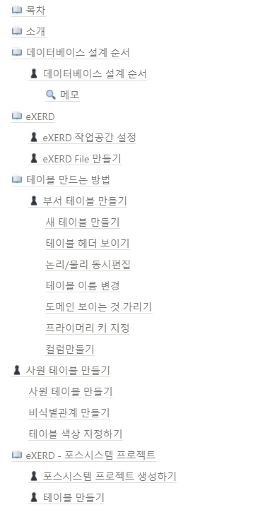

[메인으로 이동](../../../README.md)

 

# 📒 eXERD 이용하여 ERD 설계하기

# 📖 소개

- eXERD 프로그램을 통해 ERD 설계하는 방법 학습
- 사용자 요구사항을 참고하여 ERD 설계하기
- 수업일: 21-11-04

  

# 📖 목차 <a id="index">

  

# 📖 내용 <a id="content">

노션에 정리

[링크](https://blushing-scale-c79.notion.site/eXERD-ERD-f4752581e9154590bd08458e915195d1)