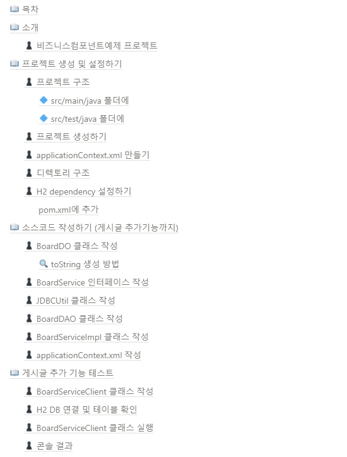
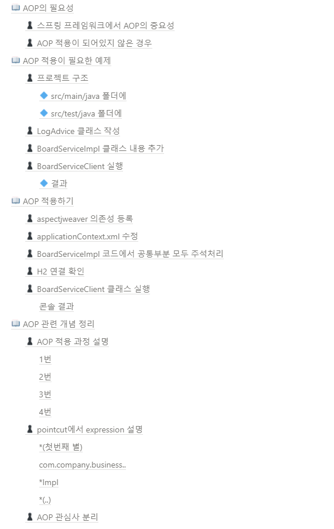

[메인으로 이동](../../../README.md)

 

# 📒 스프링 프로젝트 - 의존성 주입(어노테이션), AOP

## ♟ 비즈니스컴포넌트예제 프로젝트

- 의존성 주입
    - Service, Repository 어노테이션 활용을 위한 프로젝트
    - 게시글 목록 보여주기, 게시글 등록 기능
- AOP 적용
    - 서비스 클래스에서 메소드마다 중복되는 로그 출력 코드를 AOP를 통해 분리
- 수업일: 2021-10-29

  

# 📖 목차 <a id="index">

  

# 📖 내용 <a id="content">

노션에 정리

[링크](https://blushing-scale-c79.notion.site/AOP-09e48648a34f475e8115ae54623cdb15)