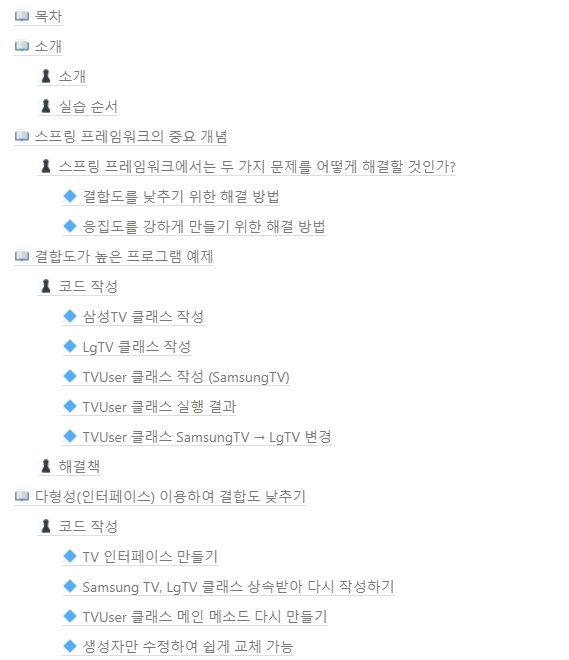
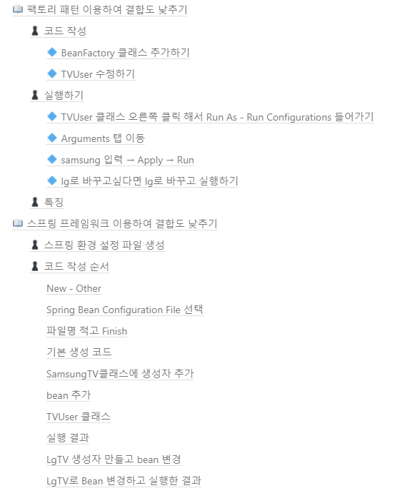
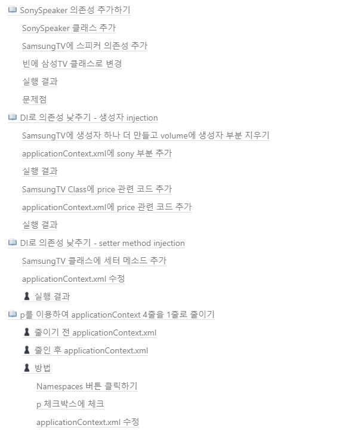

[메인으로 이동](../../../README.md)

 

# 📒 프로젝트 - 결합도, 의존도 낮추기

## ♟ 소개

- 하나의 프로젝트를 만든 뒤 여러 방법으로 수정하면서 결합도와 의존성 낮추기
- 2021-10-29 수업

## ♟ 실습 순서

1. 결합도가 높은 프로그램 만들기
2. 결합도 낮추기
    1. 다형성(인터페이스) 이용하여 낮추기
    2. 팩토리 패턴 이용하여 낮추기
3. 의존성 추가하기
4. 의존성 의존성 낮추기
    1. 생성자 injection으로 낮추기
    2. setter method injection으로 낮추기
    3. 어노테이션 통한 의존성 주입

  

# 📖 목차 <a id="index">

  

# 📖 내용 <a id="content">

노션에 정리

[링크](https://blushing-scale-c79.notion.site/0b5fee052c08485a9f474edb77c4e4e2)