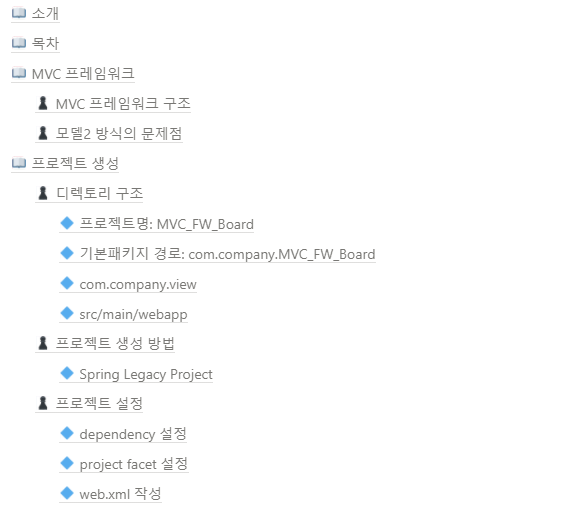
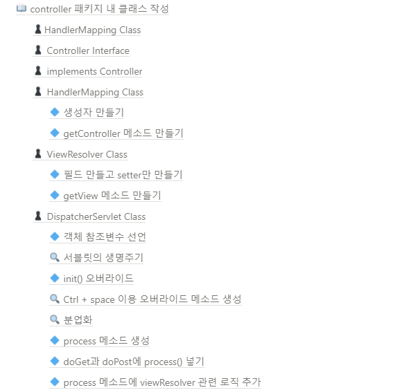
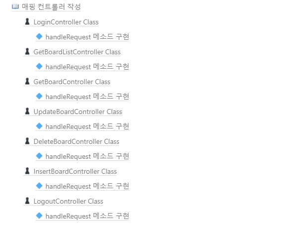

[메인으로 이동](../../../README.md)

 

# 📒 MVC 프레임워크 프로젝트 - 게시판 구현

# 📖 소개

- 모델2 방식 단점 극복한 MVC 프레임워크 기법으로 게시판 프로젝트 구현
- 수업일: 21-02-26

  

# 📖 목차 <a id="index">

  

# 📖 내용 <a id="content">

노션에 정리

[링크](https://blushing-scale-c79.notion.site/MVC-b9dc252a80bc4fc19818a737fd2b7a22)