[메인으로 이동](../../../README.md)

<br>

# 📒 프로젝트 - model2 형식으로 게시판 구현

## ♟ 소개

- model2 형식으로 게시판 CRUD 기능 구현한 프로젝트

- IDE: STS3.9.9 사용

- java, jsp, JSTL, JDBC, H2 DB 사용

- 2021-10-25 ~ 2021-10-26

<br><br>


# 📖 목차 <a id="index">

1. [📖 프로젝트 화면 구성 및 기능](#0)
1. [📖 프로젝트 환경](#1)
1. [📖 프로젝트 생성](#2)
1. [📖 프로젝트 설정](#2-1)
1. [📖 디렉토리 구조](#3)
1. [📖 DispatcherServlet 생성 방법](#4)
1. [📖 코드 작성 순서](#5)

<br><br>

# 📖 프로젝트 화면 구성 및 기능 <a id="0">

[목차로 이동](#index)

## ♟ 화면 구성 및 기능

### 🔷 로그인 창

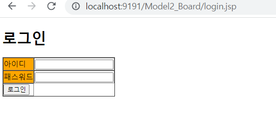

<br>

### 🔷 게시글 목록 (+로그아웃 기능)

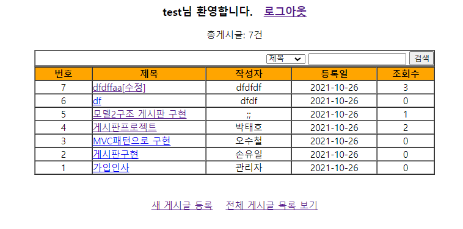

<br>

### 🔷 게시글 검색 (+제목 또는 작성자별 검색 기능)

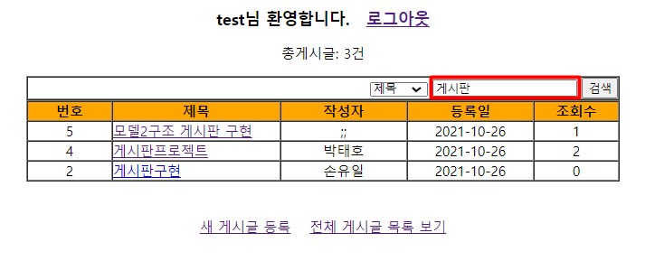

<br>

### 🔷 게시글 상세 보기 (+조회수 증가 기능)

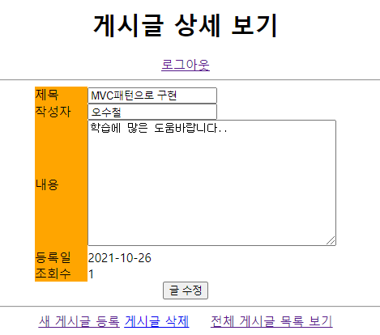

<br>

### 🔷 새 게시글 등록

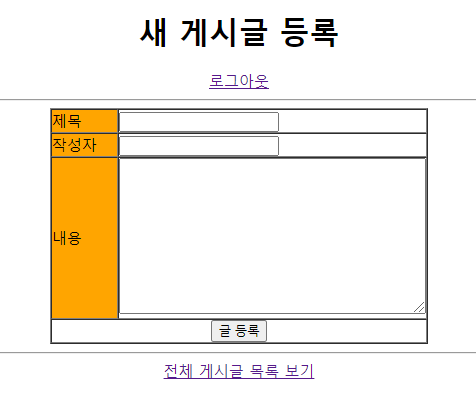


<br><br>

# 📖 프로젝트 환경 <a id="1">

[목차로 이동](#index)

## ♟ 프로젝트 환경

- IDE: STS 3.9.9
- DB: H2

<br>

## ♟ H2 DB 세팅

- Model1_Board 프로젝트의 README 참고
    - [링크](../../../Web_Study/workspace/Model1_Board/README.md)

<br><br>

# 📖 프로젝트 생성 <a id="2">

[목차로 이동](#index)

## ♟ 프로젝트 생성 방법

### 🔷 Spring Legacy Project 생성

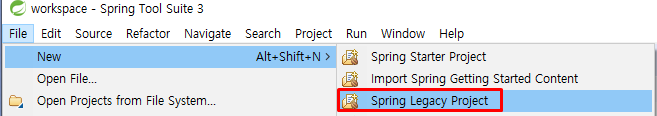

<br>

### 🔷 Templeate - Spring MVC Project 선택


<br>

### 🔷 package 설정

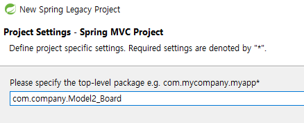

- finish 버튼이 활성화가 안될 시에는 패키지명 뒷부분을 지웠다 다시 적기

<br><br>

# 📖 프로젝트 설정 <a id="2-1">

[목차로 이동](#index)

## ♟ 프로젝트 Facets 설정

### 🔷 Dynamic Web Module과 Java 버전 변경

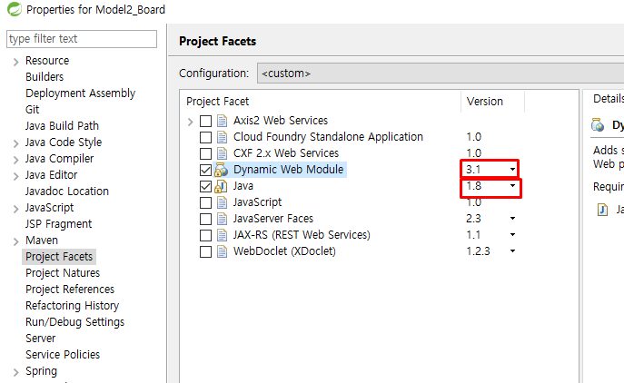

<br>

### 🔷 Runtimes 설정

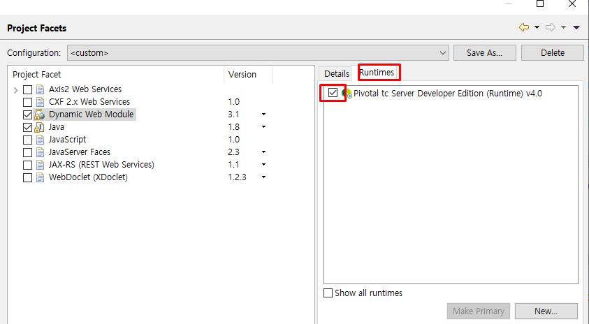

<br>

### 🔷 설정이 잘 되었는지 Libraries에서 확인

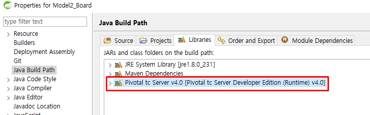

- Pivotal tc Server v4.0 라이브러리가 존재하면 Runtimes 설정이 잘된 것이다.

<br>

## ♟ pom.xml - 버전 수정

### 🔷 java와 스프링프레임워크 버전 변경

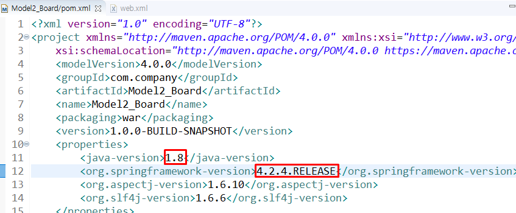

- 자바: 1.8
- 스프링프레임워크: 4.2.4.RELEASE

<br>

## ♟ pom.xml - dependency 추가

### 🔷 H2 디펜던시 추가

- https://mvnrepository.com 에서 H2 검색

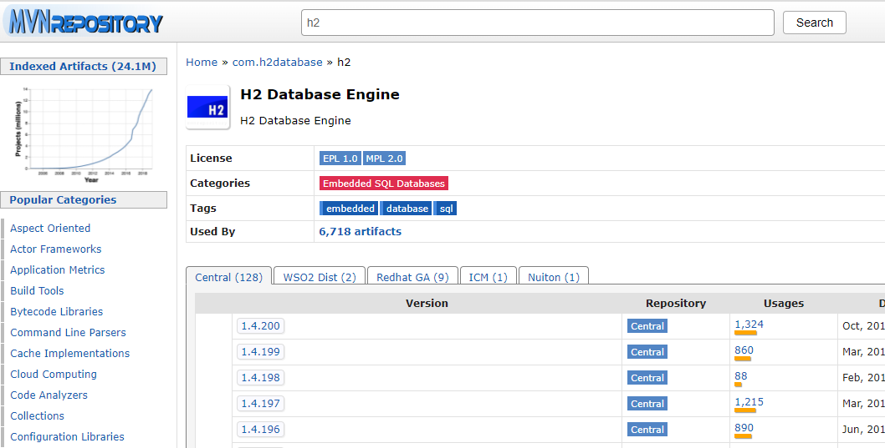

<br>

- 1.4.200 버전 선택

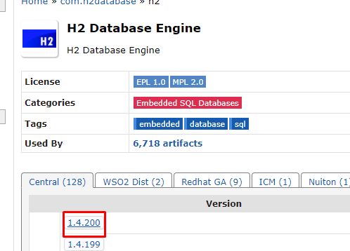

<br>

- Maven dependency 내용 복사

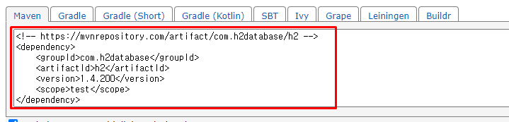

``` xml
<!-- https://mvnrepository.com/artifact/com.h2database/h2 -->
<dependency>
    <groupId>com.h2database</groupId>
    <artifactId>h2</artifactId>
    <version>1.4.200</version>
    <scope>test</scope>
</dependency>

```

<br>

- scope 부분 제거하고 pom.xml에 넣기

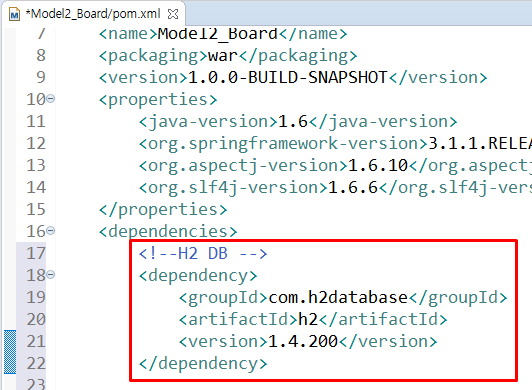

<br>

### 🍳 pom.xml 이란?

- project object model의 약자로 프로젝트의 다양한 정보를 처리하기 위한 객체모델

- 해당 파일을 통해 프로젝트의 라이브러리 관리

<br>

## ♟ web.xml 내용 작성

```xml
<?xml version="1.0" encoding="UTF-8"?>
<web-app xmlns:xsi="http://www.w3.org/2001/XMLSchema-instance" 
		 xmlns="http://java.sun.com/xml/ns/javaee" 
		 xsi:schemaLocation="http://java.sun.com/xml/ns/javaee https://java.sun.com/xml/ns/javaee/web-app_2_5.xsd" version="2.5">
	<servlet>
		<servlet-name>action</servlet-name>
		<servlet-class>com.company.view.controller.DispatcherServlet</servlet-class>
	</servlet>
	
	<servlet-mapping>
		<servlet-name>action</servlet-name>
		<url-pattern>*.do</url-pattern>
	</servlet-mapping>
</web-app>
```

<br>

## ♟ 필요없는 폴더, 내용 삭제하기

### 🔷 META-INF 삭제

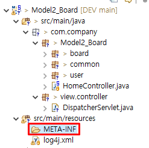

<br>

### 🔷 WEB-INF 폴더 안에 2개 폴더 (spring, views) 삭제

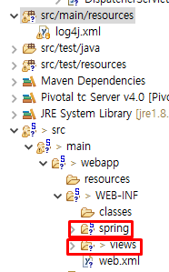

<br><br>

# 📖 디렉토리 구조 <a id="3">

[목차로 이동](#index)

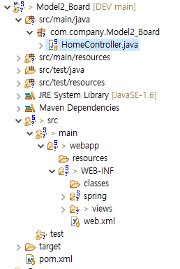


프로젝트명: Model2_Board

기본패키지 경로 com.company.Model2_Board

src/main/java 밑에 com.company.Model2_Board ⇒ 기본패키지 경로

- com.company.Model2_Board.user ⇒ 패키지 생성
    - UserDO.java
    - UserDAO.java
    
- com.company.Model2_Board.common ⇒ 패키지 생성
    - JDBCUtil.java
    
- com.company.Model2_Board.board ⇒ 패키지 생성
    - BoardDO.java
    - BoardDAO.java
    

com.company.view.controller ⇒ 패키지 생성

- 서블릿 클래스명: DispatcherServlet

src/main/webapp에 jsp 파일 생성

- error.jsp
- login.jsp
- insertBoard.jsp
- getBoardList.jsp
- getBoard.jsp


<br><br>

# 📖 DispatcherServlet 생성 방법 <a id="4">

[목차로 이동](#index)

## ♟ DispatcherServlet 생성하기

### 🔷 New - Other - Servlet

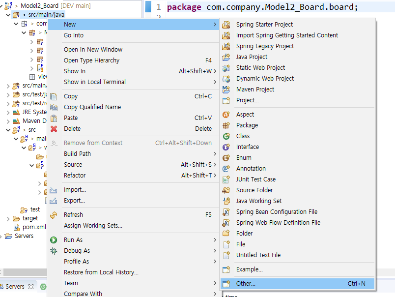

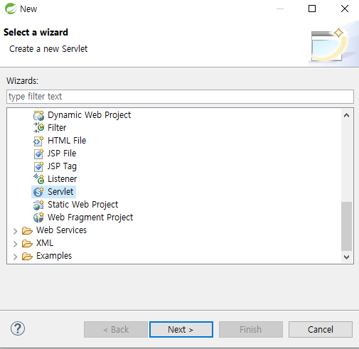

<br>

### 🔷 package, class name 설정

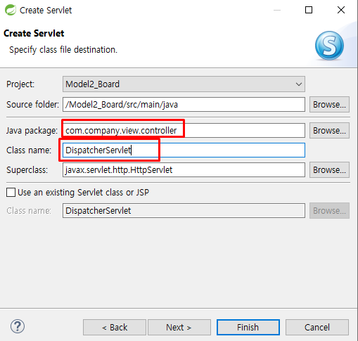

<br>

### 🔷 mapping 설정

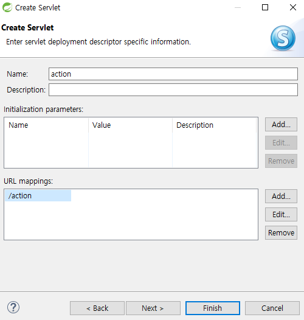

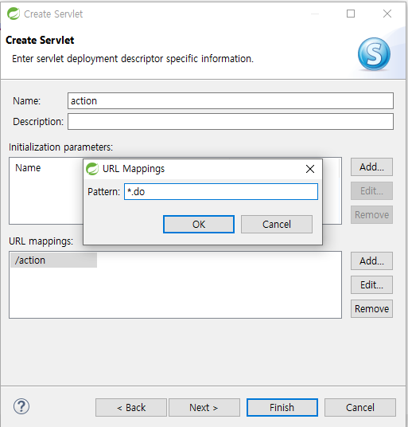

<br>

### 🔷 Finish

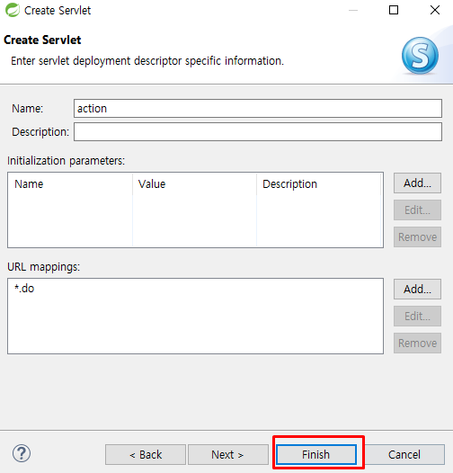


<br><br>

# 📖 코드 작성 순서 <a id="5">

[목차로 이동](#index)

## ♟ 코드 작성 순서

### 🔷 login.jsp
    로그인폼 작성

### 🔷 UserDO.java, UserDAO.java, JDBCUtil.java, BoardDO, BoardDAO.java
    Model1_Board 프로젝트에서 가져오기

### 🔷 DispatcherServlet.java
    기존 내용 삭제하고 다시 작성

### 🔷 error.jsp
    Model1_Board 프로젝트에서 가져오기

### 🔷 getBoardList.jsp
    작성 이후 DispatcherServlet.java에 `/getBoardList.do` 매핑

### 🔷 getBoard.jsp
    작성 이후 DispatcherServlet.java에 `/getBoard.do` 매핑
    getBoard.jsp에 윗부분에 스크립틀릿 추가

### 🔷 insertBoard.jsp
    작성 이후 DispatcherServlet.java에 `/inserBoard.do` 매핑

### 🔷 DispatcherServlet.java
    업데이트: `/updateBoard.do` 매핑 및 로직 작성
    삭졔: `/deleteBoard.do` 매핑 및 로직 작성
    로그아웃: `/logout.do` 매핑 및 로직 작성