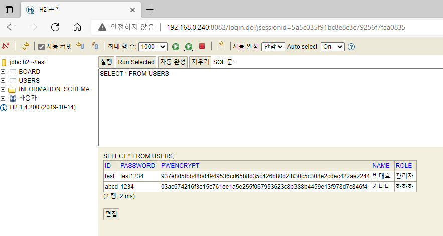
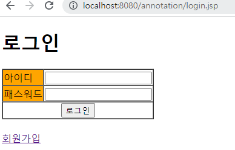
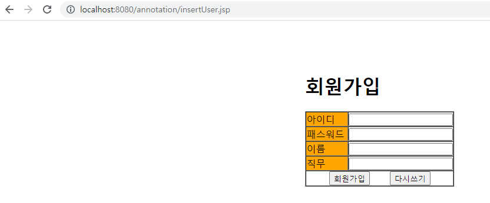
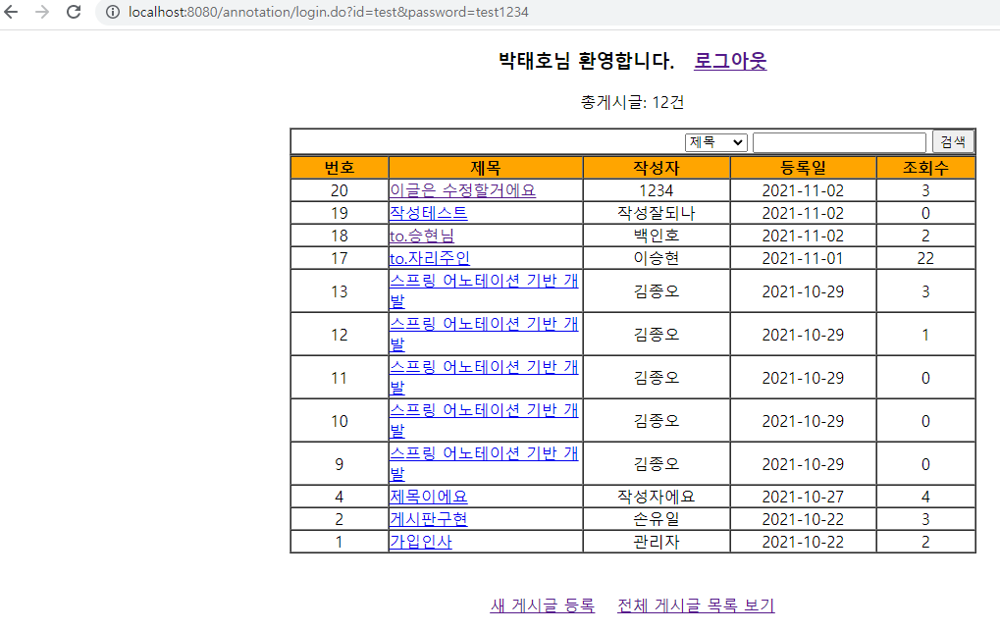
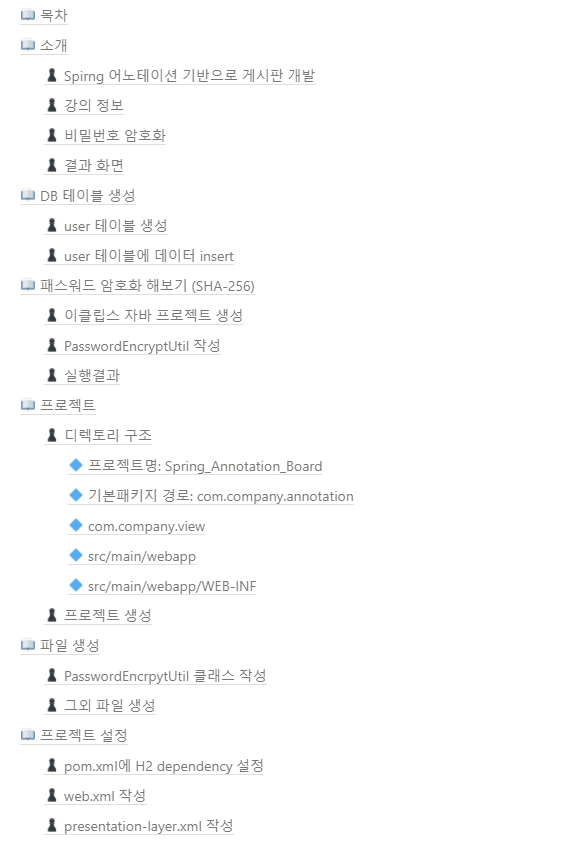

[메인으로 이동](../../../README.md)

 

# 📒 스프링 프로젝트 - 어노테이션 기반 게시판 개발

# 📖 소개

## ♟ Spirng 어노테이션 기반으로 게시판 개발

- 로그인 기능 구현
- 회원가입 기능 구현
- 회원가입 시 비밀번호를 암호화하여 '회원(users) 테이블에 저장
- 게시판 기능 구현

## ♟ 강의 정보

- 수업일: 21-11-02

## ♟ 비밀번호 암호화

## ♟ 결과 화면

  

# 📖 목차 <a id="index">

  

# 📖 내용 <a id="content">

노션에 정리

[링크](https://blushing-scale-c79.notion.site/431ffa5bf10b48d494312fc47c4310f7)