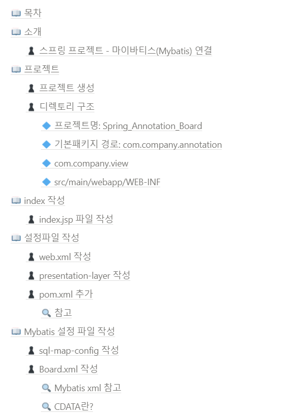
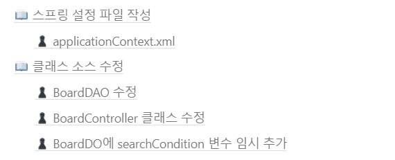

[메인으로 이동](../../../README.md)

 

# 📚 해당 프로젝트 문서

- [📒 스프링 프로젝트 - 어노테이션 기반 게시판 개발](./README.md)

- [📒 스프링 프로젝트 - 마이바티스(Mybatis) 연결](./README2.md)

 

# 📒 스프링 프로젝트 - 마이바티스(Mybatis) 연결

# 📖 소개

## ♟ 스프링 프로젝트 - 마이바티스(Mybatis) 연결

- 이전 프로젝트에서 마이바티스 추가
- 수업일: 21-10-04

  

# 📖 목차 <a id="index">

  

# 📖 내용 <a id="content">

노션에 정리

[링크](https://blushing-scale-c79.notion.site/Mybatis-6803d5ba1bea47279f33b2e9da2a1a19)