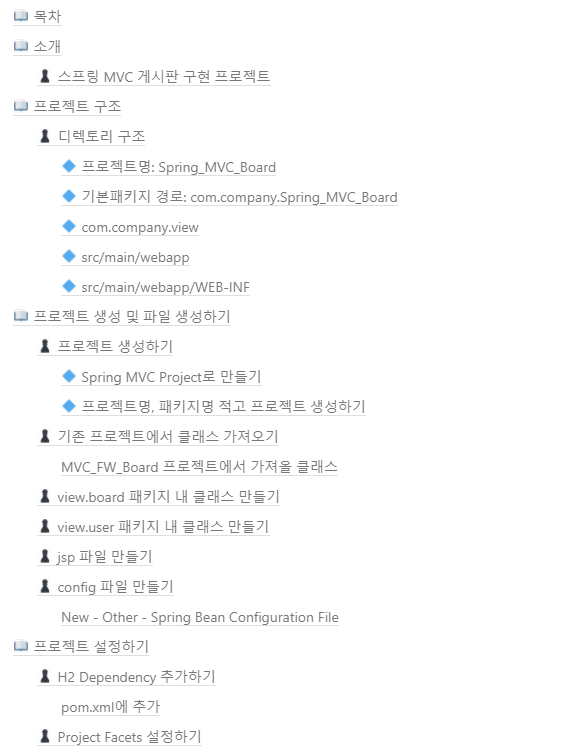
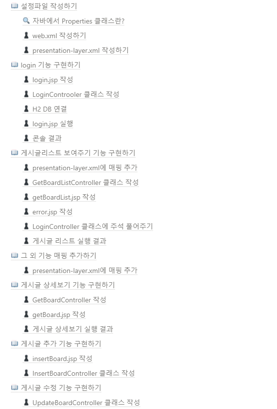

[메인으로 이동](../../../README.md)

 

# 📒 스프링 프로젝트 - 스프링 프레임워크 이용 게시판 구현

# 📖 소개

## ♟ 스프링 MVC 게시판 구현 프로젝트

- 스프링 프레임워크를 이용하여 MVC 구조로 게시판 CRUD 기능 구현하는 프로젝트
- 지금까지와는 다르게 스프링 프레임워크의 DispatcherServlet 이용
- 수업일: 21-11-01

  

# 📖 목차 <a id="index">

  

# 📖 내용 <a id="content">

노션에 정리

[링크](https://blushing-scale-c79.notion.site/70a2e1fea3644450ace72b94f20f4e72)