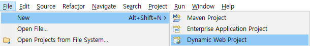
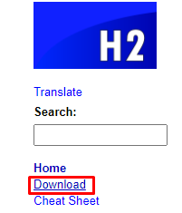
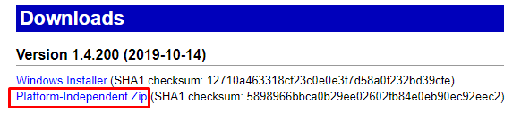
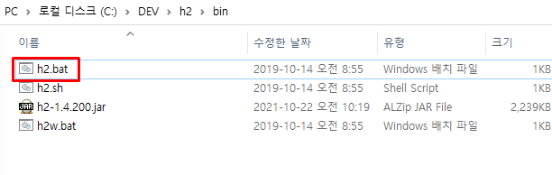
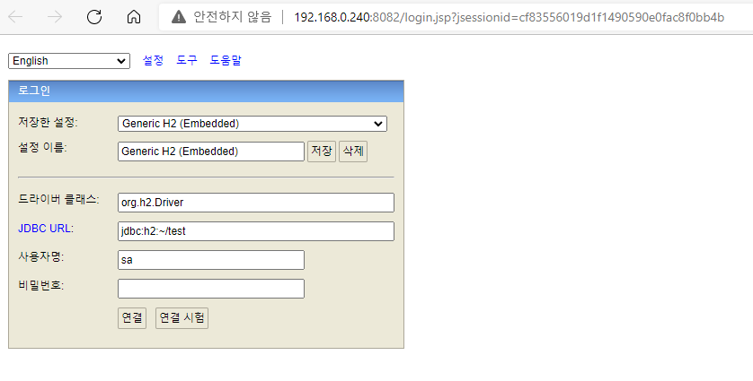
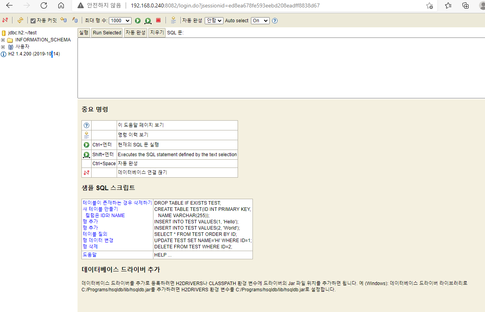
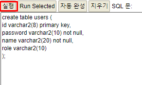
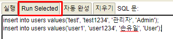
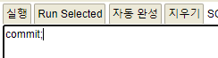
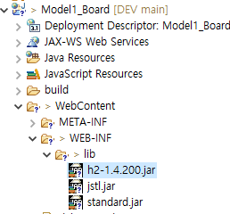

[메인으로 이동](../../../README.md)

<br>

# 📒 프로젝트 - model1 형식으로 게시판 구현

## ♟ 소개

-  model1 형식으로 게시판 구현하는 프로젝트.

- java, jsp, JSTL, JDBC, H2 DB 사용.

- 2021-10-22 ~ 2021-10-25


<br><br>


# 📖 목차 <a id="index">

1. [📖 프로젝트 환경](#1)
1. [📖 프로젝트 구조](#2)
1. [📖 H2 데이터베이스 세팅](#3)
1. [📖 필요 라이브러리](#4)
1. [📖 소스코드 작성 순서](#5)

<br><br>

# 📖 프로젝트 환경 <a id="1">

[목차로 이동](#index)


- IDE: Eclipse
- Database: H2

# 📖 프로젝트 구조 <a id="2">

[목차로 이동](#index)


## ♟ 프로젝트 생성

File - New - Dynamic Web Project



프로젝트명: Model1_Board

<br>

## ♟ 디렉토리 구조

**Java Resources/src 폴더**

- 패키지명: user
    - 클래스
        - UserDO ⇒ POJO 클래스
        - UserDAO
- 패키지명: board
    - 클래스
        - BoardDO
        - BoardDAO
- 패키지명: common
    - 클래스
        - JDBCUtil
        

**WebContent 폴더**

- jsp
    - error
    - login
    - login_proc ⇒ Controller 페이지 역할
    - insertBoard
    - insertBoard_proc ⇒ Controller 페이지 역할
    - getBoardList
    - getBoard
    - updateBoard_proc ⇒ Controller 페이지 역할
    - deleteBoard_proc ⇒ Controller 페이지 역할
    - logout_proc ⇒ ⇒ Controller 페이지 역할

<br>

<br><br>

# 📖 H2 데이터베이스 세팅 <a id="3">

[목차로 이동](#index)


## ♟ H2 데이터베이스 설치하기

- [http://h2database.com](http://h2database.com) 접속
- 홈페이지에서 다운로드





<br>

## ♟ H2 브라우저에서 실행하기

1. h2w.bat 실행

    

    

    <br>


1. 연결 누르면 아래와 같이 뜬다.

    

<br>

## ♟ 테이블 생성 및 샘플 데이터 넣기

1. **유저(user) 테이블**
    - users 테이블 생성
    
    ```java
    create table users (
    id varchar2(8) primary key,
    password varchar2(10) not null,
    name varchar2(20) not null,
    role varchar2(10) --직무
    );
    ```
    
    
    
    - users 테이블에 데이터 삽입
    
    ```java
    insert into users values('test', 'test1234', '관리자', 'Admin');
    insert into users values('user1', 'user1234', '손유일', 'User');
    ```
    
    


  <br>

2. **게시판(board) 테이블 생성**
    
    ```java
    create table board (
    seq int(5) primary key, -- 게시글번호
    title varchar2(30), -- 제목
    writer varchar2(20), -- 작성자
    content varchar2(200), -- 내용
    regdate date default sysdate, -- 작성일자
    cnt int(5) default 0 -- 조회수
    );
    
    ```
    
    ```java
    insert into board (seq, title, writer, content) values (1, '가입인사', '관리자', '잘 운영하겠습니다.');
    insert into board (seq, title, writer, content) values (2, '게시판구현', '손유일', '모델1구조로 구현');
    insert into board (seq, title, writer, content) values (3, 'MVC패턴으로 구현', '오수철', '학습에 많은 도움바랍니다..');
    insert into board (seq, title, writer, content) values (4, '게시판프로젝트', '박태호', 'SQL 문장을 잘 작성할 줄 알아야 합니다.');
    
    ```
    
<br>

3. **마지막에 commit 해주기**
    
    
    

<br><br>

# 📖 필요 라이브러리 <a id="4">

[목차로 이동](#index)


## ♟ WebContent/lib 폴더에 jar 파일들 넣기



- h2
- jstl, standard
- h2 jar 파일 위치
    
    
    
<br><br>

# 📖 소스코드 작성 순서 <a id="5">

[목차로 이동](#index)

## ♟ java 파일 작성 순서

1. UwerDO
1. BoardDO
1. JDBUtil
1. UserDAO

<br>

## ♟ jsp 파일 작성 순서

1. login
1. error
1. login_proc