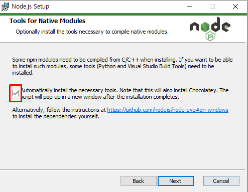
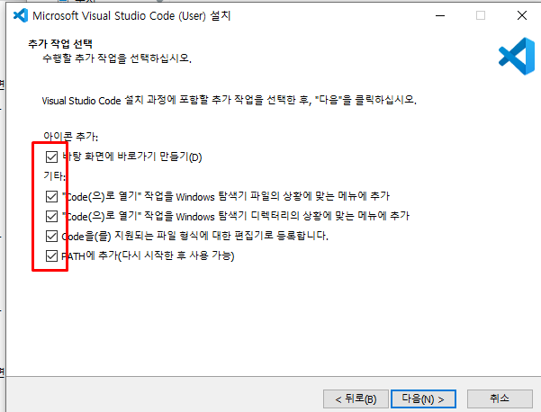
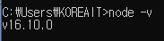
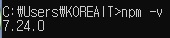
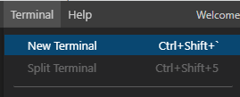
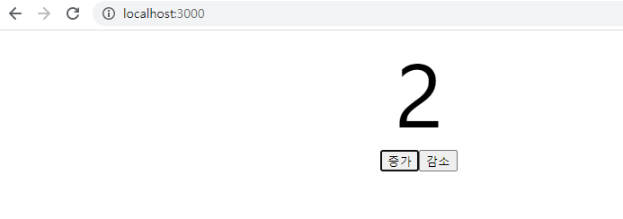
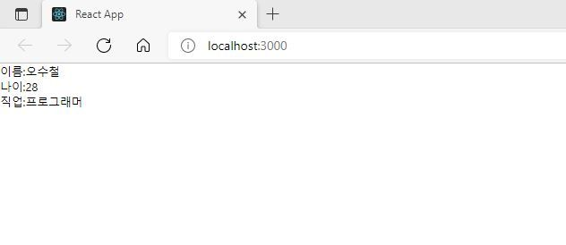

[메인으로 이동](../../README.md)

# 📒 리액트 컴포넌트 만들기

## 📖 소개 <a id= "aid-1">

- 리액트 설치부터 간단한 컴포넌트 생성까지 수업한 내용 정리
- 수업일: 21-11-10

## 📖 목차 <a id= "aid-2">

1. [소개](#aid-1)
1. [목차](#aid-2)
1. [리액트 사용 준비](#aid-3)
1. [자바스크립트 문법 ES6](#aid-4)
1. [컴포넌트 만들어보기 (클래스형, 함수형)](#aid-5)
1. [카운트 기능 만들기](#aid-6)
1. [생명주기](#aid-7)
1. [함수형 컴포넌트 + CSS](#aid-8)

## 📖 리액트 사용 준비 <a id= "aid-3">

### 노드. vsc 설치





### 노드 설치 후 확인 방법

- 명령 프롬프트 창에서 `node -v`



- `npm -v`




### 노드의 장점

1. 자바스크립트를 사용
2. 멀티 스레드
3. I/O 작업이 많은 서버로 적합 ⇒ 실시간 채팅 어플리케이션, 주식 차트, JSON 데이터를 제공하는 API 서버
4. 멀티 스레드 방식보다 쉬움
5. 웹 서버가 내장되어 있음
6. JSON 형식과 쉽게 호환됨
7. 안정성, 보안성 측면에서 검증이 되었음


[목차로 이동](#aid-2)

## 📖 자바스크립트 문법 ES6 <a id= "aid-4">

ES2015 + (ES6) ⇒ 노드 6 버전부터 ES6 문법을 사용한다.

### (1) 변수

- var:
    - 함수 스코프(scope) {   } 즉, 블록과 관계없이 접근할 수 있다.
- const
    - 블록 스코프(scope) {   } 즉, 블록 밖에서는 변수에 접근할 수 없다.
    - 초기화할 때 값을 할당하지 않으면 에러가 발생한다.
    - 한 번 값을 할당하면 다른 값을 할당할 수 없다.
- let
    - 블록 스코프(scope) {   } 즉, 블록 밖에서는 변수에 접근할 수 없다.
    - 한 번 값을 할당하고 나서 다른값으로 할당이 가능하다.

(예)

```jsx
const a = 0;
// a = 1; // Uncaught TypeError

let b = 0;
b = 1;

// const c; // Uncaught SyntexError
```

### (2) 템플릿 문자열이라는 새로운 문자열이 생겼다.

기존 ES5 문법을 사용한 문자열 예제

```jsx
var num1 = 10;
var num2 = 20;
var result = 30;
var string1 = num1 + ' 더하기 ' + num2 + '은 \'' + result + '\'';
console.log(string1); // 10 더하기 20은 '30'
```

ES6 문법을 사용한 문자열 예제 ⇒ 백틱(`)으로 감싼다.

```jsx
const num3 = 10;
const num4 = 20;
const result2 = 30;
const string2 = `${num3} 더하기 ${num4}은 '${result2}'`;
console.log(string2); // 10 더하기 20은 '30'
```

- 소스의 가독성 향상

### (3) 화살표 함수(arrow function) 추가

```jsx
function add1(x, y) {
	return x + y;
}

const add2 = (x, y) => { // 화살표 함수 적용한 소스
	return x + y;
};

const add3 = (x, y) => x + y;
```

- add1, add2, add3 함수 모두 동일한 결과값이 나온다.

### (4) 구조 분해 할당

구조 분해 할당을 사용하면 객체와 배열로부터 속성이나 요소를 쉽게 꺼낼 수 있다.

```jsx
var array = ['nodejs', {}, 10, true];
var node = array[0];
var obj = array[1];
var int = array[2];
var bool = array[3];
```

```jsx
const array = ['nodejs', {}, 10, true];
const [node, obj, int, bool] = array;
```

- 노드는 모듈 시스템을 사용하므로 이러한 방식을 자주 쓴다.


[목차로 이동](#aid-2)

## 📖 컴포넌트 만들어보기 (클래스형, 함수형) <a id= "aid-5">

### 결과화면


### 리액트 프로젝트 만들기

C:\react-ex 폴더 생성 (나는 DEV 안에 react-ex 폴더 생성)

react-ex 폴더 안에 react-test 폴더 생성

- 주의: 리액트 프로젝트명은 반드시 소문자로 적는다. (대문자 X)

vsc에서 폴더 추가하기


vsc의 터미널에서 다음 명령어로 리액트 프로젝트 생성하기



```jsx
npx create-react-app .
```

### 클래스형 컴포넌트

```jsx
/* 클래스형 컴포넌트 생성 */
import React, { Component } from 'react';

class App extends Component {
  render() {
    const summary = '사용자 UI를 효과적으로 구축하기 위해 사용하는 자바스크립트 기반의 라이브러리이다.';
    return (
      <form>
        <h2>리액트란?</h2>
        <div>{summary}</div>
      </form>
    );
  }
}

export default App;
```

### 실행하기

```jsx
npm run start
```

### 함수형 컴포넌트

```jsx
/* 함수형 컴포넌트 생성 */
import React from 'react'

function App() {
  const summary = '사용자 UI를 효과적으로 구축하기 위해 사용하는 자바스크립트 기반의 라이브러리이다.';
  return (
    <form>
      <h2>리액트란?</h2>
      <div>{summary}</div>
    </form>
  );
}

export default App;
```


[목차로 이동](#aid-2)

## 📖 카운트 기능 만들기 <a id= "aid-6">

### 결과화면



### 클래스형 컴포넌트로 구현

```jsx
import React from 'react';

class App extends React.Component {
  state = { number: 0};
  render() {
    return (
      <div style={{textAlign: "center"}}>
        <div style={{fontSize: "100px"}}>{this.state.number}</div>
        <button onClick={this.handleClickIncrement}>증가</button>
        <button onClick={this.handleClickDecrement}>감소</button>
      </div>
    );
  }
  handleClickIncrement = () => {
    this.setState(state => ({
      number: state.number + 1
    }));
  };

  handleClickDecrement = () => {
    this.setState(state => ({
      number: state.number - 1
    }));
  };

}

export default App;
```

### 함수형 컴포넌트로 구현

```jsx
import React, {useState} from 'react';

const App = () => {
  const [number, setNumber] = useState(0);
  return (
    <div style={{textAlign: "center"}}>
      <div style={{fontSize: "100px"}}>{number}</div>
      <button onClick={() => setNumber(number + 1)}>증가</button>
      <button onClick={() => setNumber(number - 1)}>감소</button>
    </div>
  );
}

export default App;
```

### 🔍 state란?

- 컴포넌트 내부에서 가지고 있는 Component의 상태값이다.
- 객체의 형태를 가지고 있으며, 컴포넌트 내에서만 정의하고 사용 가능하며, 얼마든지 값이 바뀔 수 있다.
- 렌더링 결과물에 영향을 주는 정보
- state를 활용해 데이터를 변화시켜줄 수 있다.

### 🔍 setState() 함수의 역할

- state 값을 변경하기 위해서는 이 함수를 사용한다.
    - "state 객체에 대한 update를 실행"이라고 리액트 공식 사이트에 정의

### 🔍 useState() 함수의 역할

- 함수형 컴포넌트에서는 리액트 훅(hook)을 사용하여 useState() 함수를 통해 state값을 불러오고 변경할 수 있다.
- useState() 함수는 state의 초기값을 정할 수 있고, return 값으로 state를 돌려주는 hook이다.
- useState() 함수가 호출되면 배열을 반환하는데 그 배열의 첫번째 원소는 상태값이고, 두번째 원소는 상태값을 update하는 함수이다.
- 예시
    - `const [number, setNumber] = useState(0);`


[목차로 이동](#aid-2)

## 📖 생명주기 <a id= "aid-7">

### 결과화면




### 리액트에서 생명주기란?

- Component의 생성, 변경, 소멸 과정을 뜻한다.
- Component의 생성의 '생성' 과정에 사용하는 함수들
    - render() ⇒ return되는 html 형식의 코드를 화면에 그려주는 함수
    - constructor() ⇒ 생명주기 함수 중 가장 먼저 실행되며, 처음 한 번만 호출된다.
    

### constructor 사용

```jsx
import React from 'react';

export default class App extends React.Component {
  constructor(props) {
    super(props);
    this.state = {
      name: '오수철',
      age: 28,
      job: '프로그래머'
    }
  }
  render() {
    const { name, age, job } = this.state;
    return (
      <div>
        <div>이름: {name}</div>
        <div>나이: {age}</div>
        <div>직업: {job}</div>
      </div>
    );
  }
}
```


[목차로 이동](#aid-2)

## 📖 함수형 컴포넌트 + CSS <a id= "aid-8">

### 결과화면


### App.js

```jsx
import React from 'react';
import './App.css';

function App() {
  return (
    <div>
      <h1>React는 자바스크립트 라이브러리의 하나</h1>
      <p>함수형 컴포넌트 생성하기</p>
    </div>
  );
}
export default App;
```

### App.css

```css
div {
  background-color: rgb(162, 127, 243);
  color: rgb(255, 255, 255);
  padding: 40px;
  font-family: 고딕;
  text-align: center;
}

h1 {
  color: white;
  background-color: #2EF2EE;
  padding: 10px;
  font-family: 궁서;
}
```

[목차로 이동](#aid-2)

[메인으로 이동](../../README.md)