[메인으로 이동](../../README.md)

### 📚 해당 프로젝트 문서

1. [📒 리액트 컴포넌트 만들기](./README.md)
1. [📒 리액트 props, state, 라우팅](./README2.md)

<br>

# 📒 리액트 props, state, 라우팅

## 📖 소개 <a id="aid-1">

- 리액트 props, children, 상태관리(useState), 라우팅(react-router-dom) 수업
- 수업일: 21-11-11 ~ 21-11-12

## 📖 목차 <a id="aid-2">

1. [props](#aid-3)
1. [children](#aid-4)
1. [조건부 렌더링](#aid-5)
1. [input 상태 관리](#aid-6)
1. [여러 개의 input 상태 관리](#aid-7)
1. [라우팅](#aid-8)


## 📖 props <a id="aid-3">

### props와 state

리액트 컴포넌트에서 다루는 데이터는 두 가지로 나눈다.

(1)  state

- 컴포넌트 내부에서 선언하며 내부에서 값을 변경할 수 있다.

(2) props

- properties의 줄임말로 부모 컴포넌트가 자식 컴포넌트에게 전달해주는 값이다.
- 자식 컴포넌트에서는 props를 받아 오기만 하고, 받아온 props를 직접 수정할 수는 없다.

### 초기 코드작성

Payment.js

```jsx
import React, { Component } from 'react';

class Payment extends Component {
    render() {
        return(
            <div>
                <br />
                감사합니다. 결제금액은 <b>{this.props.amount}</b> 입니다.
            </div>
        );
    }
}

export default Payment;
```

App.js

```jsx
/* props 실습 */
import React, { Component } from 'react';
import Payment from './Payment';

class App extends Component {
  render() {
    return (
      <Payment amount="560000원" /> /* <자식컴포넌트 props_name="props_value" /> */
    );
  }
}

export default App;
```

### 결과화면

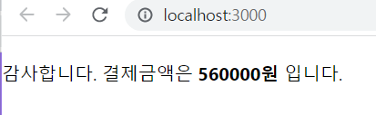

### 함수형 컴포넌트의 화살표 함수로 변경

Payment.js

```jsx
/* 위 클래스형 컴포넌트를 함수형 컴포넌트로 변경 */
import React from 'react';

const Payment = ({amount}) => {
  return (
    <div>
      <br />
      감사합니다. 결제금액은 <b>{amount}</b> 입니다.
    </div>
  )
}

export default Payment;
```

### 함수형 컴포넌트로 변경

Payment.js

```jsx
/* 위 클래스형 컴포넌트를 함수형 컴포넌트로 변경 */
import React from 'react';

function Payment(props) {
    return (
        <div>
            <br />
            감사합니다! 결제금액은 <b>{props.amount}</b>
        </div>
    );
}

export default Payment;
```

### props 2개로

App.js

```jsx
/* props 실습 */
import React, { Component } from 'react';
import Payment from './Payment';

class App extends Component {
  render() {
    return (
      <Payment amount="560000원" color="red"/> /* <자식컴포넌트 props_name="props_value" /> */
    );
  }
}

export default App;
```

Payment.js

```jsx
/* 위 클래스형 컴포넌트를 함수형 컴포넌트로 변경 */
import React from 'react';

function Payment(props) {
    return (
        <div>
            <br />
            감사합니다! 결제금액은 <div style={{ color: props.color }}><b>{props.amount}</b></div> 입니다.
        </div>
    );
}

export default Payment;
```

결과

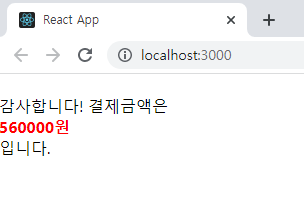

### 구조분해 할당으로 구현

Payment.js

```jsx
/* 위 소스를 구조 분해 할당으로 구현 */
import React from 'react';

function Payment({ color, amount }) {
    return (
        <div>
            <br />
            감사합니다! 결제금액은 <div style={{color}}><b>{amount}</b></div> 입니다.
        </div>
    );
}

export default Payment;
```

[목차로 이동](#aid-2)

## 📖 children <a id="aid-4">

### children 이용

App.js

```jsx
/* props 실습 */
import React, { Component } from 'react';
import Payment from './Payment';
import Wrapper from './Wrapper';

class App extends Component {
  render() {
    return (
      <Wrapper>
        <Payment amount="560000원" color="red"/> {/* <자식컴포넌트 props_name="props_value" /> */}
      </Wrapper>
    );
  }
}

export default App;
```

Wrapper.js

```jsx
import React from 'react';

function Wrapper() {
    const style = {
        border: '2px solid black',
        padding: '16px'
    };

    return (
        <div style={style}></div>
    )
}

export default Wrapper;
```

결과화면

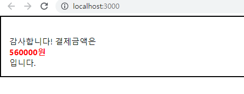

### 🔍 참고

props.children

- 컴포넌트 태그 사이에 넣은 값을 조회하고 싶을 때 props.children을 조회하면 된다.
- 즉, 내부의 내용이 보여지게 하기 위해서는 Wrapper 자식 컴포넌트에서 props.children을 렌더링해주어야 한다.


[목차로 이동](#aid-2)

## 📖 조건부 렌더링 <a id="aid-5">

### 조건부 렌더링

- 특정 조건에 따라 결과물을 렌더링하는 것을 의미한다.
- isSpecial 이라는 props를 설정한다.

App.js

```jsx
/* props 실습 */
import React, { Component } from 'react';
import Payment from './Payment';
import Wrapper from './Wrapper';

class App extends Component {
  render() {
    return (
      <Wrapper>
        <Payment amount="560000원" color="red" isSpecial={true}/> {/* <자식컴포넌트 props_name="props_value" /> */}
      </Wrapper>
    );
  }
}

export default App;
```

Payment.js

```jsx
/* 위 소스를 구조 분해 할당으로 구현 */
import React from 'react';

function Payment({ color, amount, isSpecial }) {
    return (
        <div>
            <br />
            { isSpecial ? <b>*</b> : null}
            감사합니다! 결제금액은 <div style={{color}}><b>{amount}</b></div> 입니다.
        </div>
    );
}

export default Payment;
```

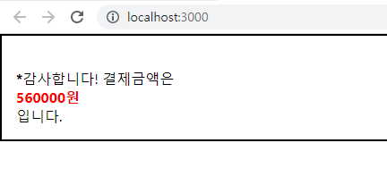


[목차로 이동](#aid-2)

## 📖 input 상태 관리 <a id="aid-6">

### input 상태 관리하기

- e.target.value를 조회하면 현재 input에 입력한 값이 무엇인지 알 수 있다.
- 자식 컴포넌트 생성 ⇒ InputSample.js

결과화면

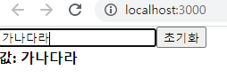

InputSample.js

```jsx
import React, { useState } from 'react'

function InputSample() {
    const [text, setText] = useState('');

    const onChange = (e) => {
        setText(e.target.value);
    };

    const onReset = (e) => {
        setText('');
    };

    return (
        <div>
            <input onChange={onChange} value={text}/>
            <button onClick={onReset}>초기화</button>
            <div>
                <b>값: {text}</b>
            </div>
        </div>
    );
}

export default InputSample;
```

App.js

```jsx
/* input 상태 관리하기 */
import React from 'react';
import InputSample from './InputSample';

function App() {
  return (
    <InputSample />
  );
}

export default App;
```


[목차로 이동](#aid-2)

## 📖 여러 개의 input 상태 관리 <a id="aid-7">

### spread 문법

spread 문법 적용할 때 사용하는 연산자 ⇒ ...

... spread 연산자의 장점

⇒ 기존의 배열은 건드리지 않으면서 새로운 배열에 기존 배열이 가지고 있는 내용을 모두 집어넣고 새로운 배열을 만든다.

(예)

```jsx
const employee = ['박태호', '오수철', '손유일', '이두희'];
const anotherEmployee = [...employee, '김종오'];
console.log(employee);
console.log(anotherEmployee);
```

### 결과화면

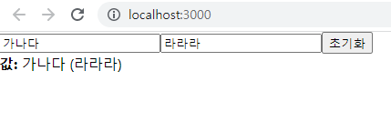

### 코드

InputSample.js

```jsx
import React, { useState } from 'react'

function InputSample() {
    const [inputs, setInputs] = useState({
        name: '',
        nickname: ''
    });

    const { name, nickname } = inputs; // 구조 분해 할당을 통해 값 추출

    const onChange = (e) => {
        const { value, name } = e.target; // 우선 e.target에서 name과 value를 추출
        setInputs({
            ...inputs, [name]: value
        });
    };

    const onReset = (e) => {
        setInputs({
            name: '',
            nickname: ''
        });
    };

    return (
        <div>
            <input name="name" placeholder="이름" onChange={onChange} value={name}/>
            <input name="nickname" placeholder="닉네임" onChange={onChange} value={nickname}/>
            <button onClick={onReset}>초기화</button>
            <div>
                <b>값: </b>
                {name} ({nickname})
            </div>
        </div>
    );
}

export default InputSample;
```

App.js

```jsx
/* input 상태 관리하기 */
import React from 'react';
import InputSample from './InputSample';

function App() {
  return (
    <InputSample />
  );
}

export default App;
```


[목차로 이동](#aid-2)

## 📖 라우팅 <a id="aid-8">

기존 index.js

```jsx
import React from 'react';
import ReactDOM from 'react-dom';
import './index.css';
import App from './App';
import reportWebVitals from './reportWebVitals';

ReactDOM.render(
  <React.StrictMode>
    <App />
  </React.StrictMode>,
  document.getElementById('root')
);

// If you want to start measuring performance in your app, pass a function
// to log results (for example: reportWebVitals(console.log))
// or send to an analytics endpoint. Learn more: https://bit.ly/CRA-vitals
reportWebVitals();
```

### 실습1

index.js 수정

```jsx
import React from 'react';
import ReactDOM from 'react-dom';
import './index.css';

function Home() {
  return (
    <div>
      <h2>Home</h2>
      Home...
    </div>
  );
}

function App() {
  return (
    <div>
      <h1>React Router DOM 예제</h1>
      <Home></Home>
    </div>
  );
}

ReactDOM.render(<App/>, document.getElementById('root'));
```

결과

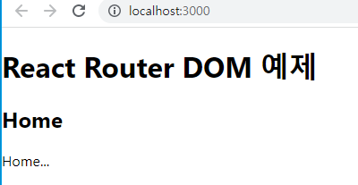

### 실습2

```jsx
import React from 'react';
import ReactDOM from 'react-dom';
import './index.css';

function Home() {
  return (
    <div>
      <h2>Home</h2>
      Home...
    </div>
  );
}

function Topics() {
  return (
    <div>
      <h2>Topics</h2>
      Topics...
    </div>
  );
}

function Contact() {
  return (
    <div>
      <h2>Contact</h2>
      Contact...
    </div>
  );
}

function App() {
  return (
    <div>
      <h1>React Router DOM 예제</h1>
      <Home></Home>
      <Topics></Topics>
      <Contact></Contact>
    </div>
  );
}

ReactDOM.render(<App/>, document.getElementById('root'));
```

결과

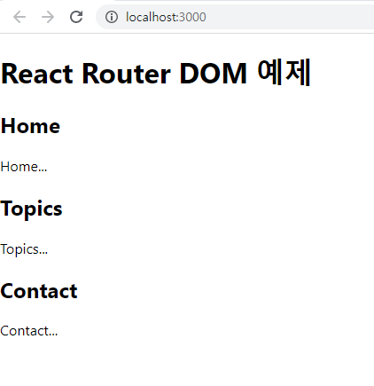

### React router DOM 설치

```jsx
npm install react-router-dom
```

### 링크 만들기

```jsx
import React from 'react';
import ReactDOM from 'react-dom';
import './index.css';
import {BrowserRouter, Route, Switch, Link, NavLink, useParams} from 'react-router-dom';

function Home() {
  return (
    <div>
      <h2>Home</h2>
      Home...
    </div>
  );
}

function Topics() {
  return (
    <div>
      <h2>Topics</h2>
      Topics...
    </div>
  );
}

function Contact() {
  return (
    <div>
      <h2>Contact</h2>
      Contact...
    </div>
  );
}

function App() {
  return (
    <div>
      <h1>React Router DOM 예제</h1>
      <ul>
        <li><a href="/">Home</a></li>
        <li><a href="/topics">Topics</a></li>
        <li><a href="/contact">Contact</a></li>
      </ul>
    </div>
  );
}

ReactDOM.render(<BrowserRouter><App/></BrowserRouter>, document.getElementById('root'));
```

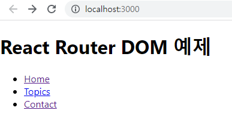

### 라우트

```jsx
import React from 'react';
import ReactDOM from 'react-dom';
import './index.css';
import {BrowserRouter, Routes, Route} from 'react-router-dom';

function Home() {
  return (
    <div>
      <h2>Home</h2>
      Home...
    </div>
  );
}

function Topics() {
  return (
    <div>
      <h2>Topics</h2>
      Topics...
    </div>
  );
}

function Contact() {
  return (
    <div>
      <h2>Contact</h2>
      Contact...
    </div>
  );
}

function App() {
  return (
    <div>
      <h1>React Router DOM 예제</h1>
      <ul>
        <li><a href="/">Home</a></li>
        <li><a href="/topics">Topics</a></li>
        <li><a href="/contact">Contact</a></li>
      </ul>
      <Routes>
        <Route exact path="/" element={<Home/>}/>
        <Route path="/topics" element={<Topics/>}/>
        <Route path="/contact" element={<Contact/>}/>
      </Routes>
    </div>
  );
}

ReactDOM.render(<BrowserRouter><App/></BrowserRouter>, document.getElementById('root'));
```

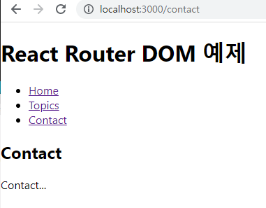

### NavLink 사용

index.js

```jsx
import React from 'react';
import ReactDOM from 'react-dom';
import './index.css';
import {BrowserRouter, Routes, Route, NavLink} from 'react-router-dom';

function Home() {
  return (
    <div>
      <h2>Home</h2>
      Home...
    </div>
  );
}

function Topics() {
  return (
    <div>
      <h2>Topics</h2>
      Topics...
    </div>
  );
}

function Contact() {
  return (
    <div>
      <h2>Contact</h2>
      Contact...
    </div>
  );
}

function App() {
  return (
    <div>
      <h1>React Router DOM 예제</h1>
      <ul>
        <li><NavLink exact to="/">Home</NavLink></li>
        <li><NavLink to="/topics">Topics</NavLink></li>
        <li><NavLink to="/contact">Contact</NavLink></li>
      </ul>
      <Routes>
        <Route exact path="/" element={<Home/>}/>
        <Route path="/topics" element={<Topics/>}/>
        <Route path="/contact" element={<Contact/>}/>
      </Routes>
    </div>
  );
}

ReactDOM.render(<BrowserRouter><App/></BrowserRouter>, document.getElementById('root'));
```

index.css

```css
.active {
  background-color: tomato;
  text-decoration: none;
}
```

결과

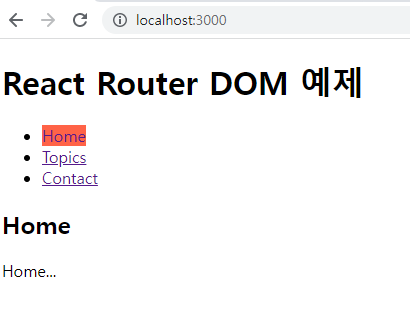

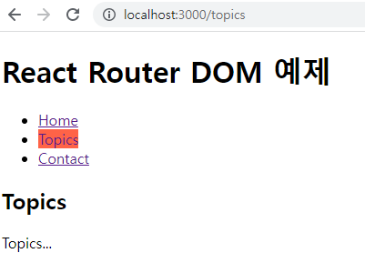

### 🔍 참고

Route 컴포넌트는 주소(url)에 따라 다른 화면을 보여주는 라우팅 기능을 가진 컴포넌트이다.

라우팅이란? 다른 주소에 따라 화면을 보여주는 것

NavLink 컴포넌트는 설정한 URL이 활성화되면, 특정 스타일 혹은 클래스를 지정할 수 있다.

### NavLink 컴포넌트

- Link 컴포넌트와 비슷하다.
- 설정한 URL이 활성화되면, 특정 스타일 혹은 CSS 클래스를 적용할 수 있는 컴포넌트이다.


### 부모, 자식 컴포넌트에 Routes

index.js

```jsx
import React from 'react';
import ReactDOM from 'react-dom';
import './index.css';
import {BrowserRouter, Routes, Route, NavLink, useParams} from 'react-router-dom';

function Home() {
  return (
    <div>
      <h2>Home</h2>
      Home...
    </div>
  );
}

let contents = [
  { id:1, title:'HTML', description:'HTML is ...'},
  { id:2, title:'JavaScript', description:'JavaScript is ...'},
  { id:3, title:'React', description:'React is ...'},
]

function Topic() {
  let params = useParams();
  console.log('params', params);
  let topic_id = params.topic_id;
  let selected_topic = {
    title: 'Sorry',
    description: 'Not Found'
  };

  for (let i = 0; i < contents.length; i++) {
    if (contents[i].id === Number(topic_id)) {
      selected_topic = contents[i];
      break;
    }
  }

  return(
    <div>
      <h3>{selected_topic.title}</h3>
      {selected_topic.description}
    </div>
  );
}

function Topics() {
  console.log('Topics')
  let list = [];
  for(let i = 0; i < contents.length; i++) {
    list.push(<li key={contents[i].id}><NavLink to={'/topics/'+contents[i].id}>{contents[i].title}</NavLink></li>);
  }
  return (
    <div>
      <h2>Topics</h2>
      <ul>
        {list}
      </ul>
      <Routes>
        <Route path=":topic_id" element={<Topic/>}/>
      </Routes>
    </div>
  );
}

function Contact() {
  return (
    <div>
      <h2>Contact</h2>
      Contact...
    </div>
  );
}

function App() {
  return (
    <div>
      <h1>React Router DOM 예제</h1>
      <ul>
        <li><NavLink to="/">Home</NavLink></li>
        <li><NavLink to="/topics">Topics</NavLink></li>
        <li><NavLink to="/contact">Contact</NavLink></li>
      </ul>
        <Routes>
          <Route path="/" element={<Home/>}/>
          <Route path="/topics/*" element={<Topics/>}/>
          <Route path="/contact" element={<Contact/>}/>
        </Routes>
    </div>
  );
}

ReactDOM.render(<BrowserRouter><App/></BrowserRouter>, document.getElementById('root'));
```

