[메인으로 이동](../../README.md)

# 📒 StarUML 유즈 케이스(Use Case) 작성

## 📖 소개

- StarUML 프로그램을 활용하여 Use Case 작성하는 법 정리
- 쇼핑몰 Use Case Diagram 만들기
- 수업일: 21-11-08

## 📖 목차

1. 소개
1. UML이란?
1. StarUML로 Use Case 만들어보기
1. 쇼핑몰 유즈케이스 만들기

## 📖 UML이란?

### UML

- 클래스 다이어그램
- 유즈 케이스(Use Case)
    - 사용자 또는 관리자 관점에서 바라본 시스템 or 웹 사이트 내용에 대한 '시나리오'의 집합으로 볼 수 있다.
    - 시스템 개발 과정의 모든 단계를 끌어낸다.
    - 사용자 시각에서 소프트웨어 범위와 기능을 설명하는 설계 표기법이라고도 한다.

## 📖 StarUML로 Use Case 만들어보기

### Use Case 다이어그램 생성하기

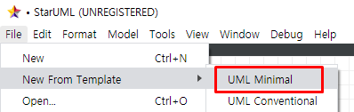

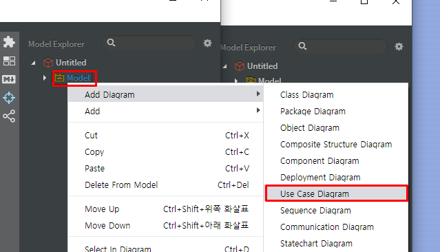

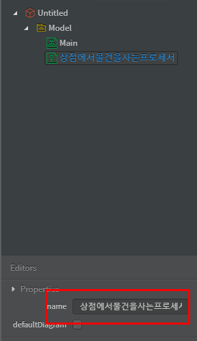

### Actor와 Use Case Subject 생성하기

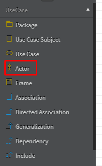

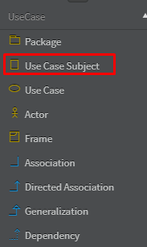

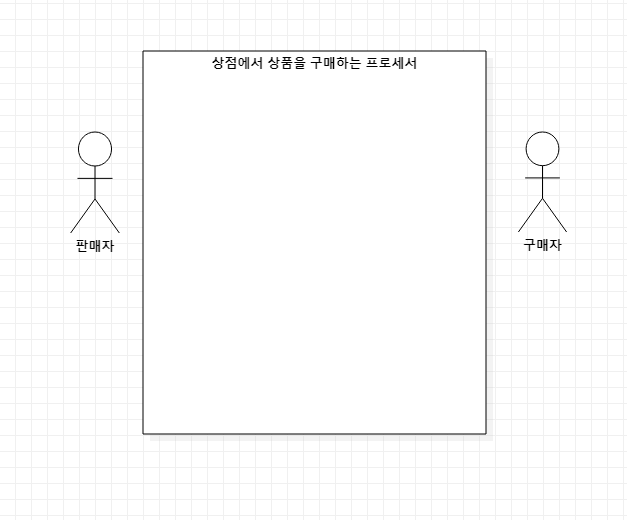

### Use Case와 Association 생성하기

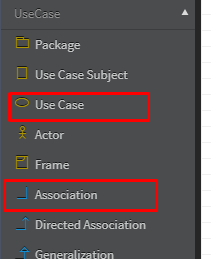

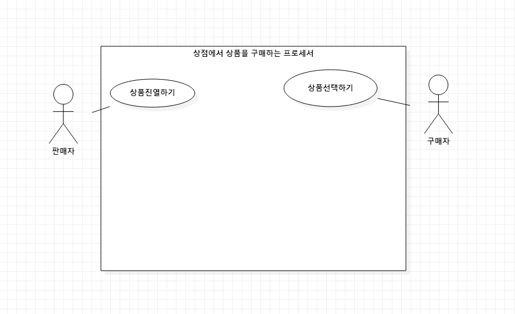

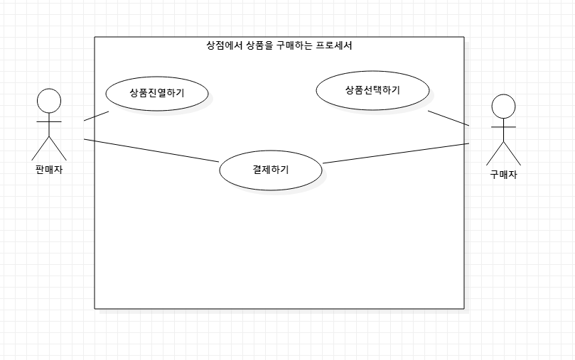

### Include와 Extend 생성하기

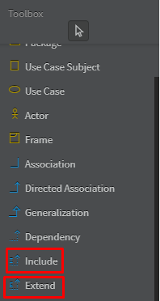

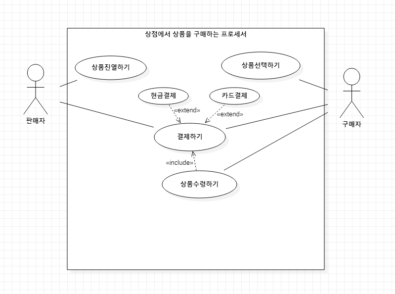

## 📖 쇼핑몰 유즈케이스 만들기

유스케이스 이름: 쇼핑몰유즈케이스

### Directed Association

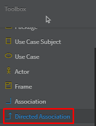

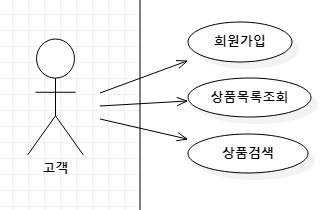

### Generalization

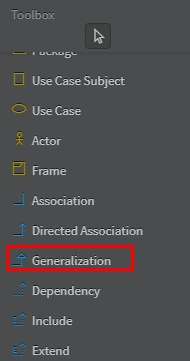

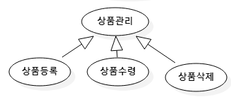

### Use Case Diagram

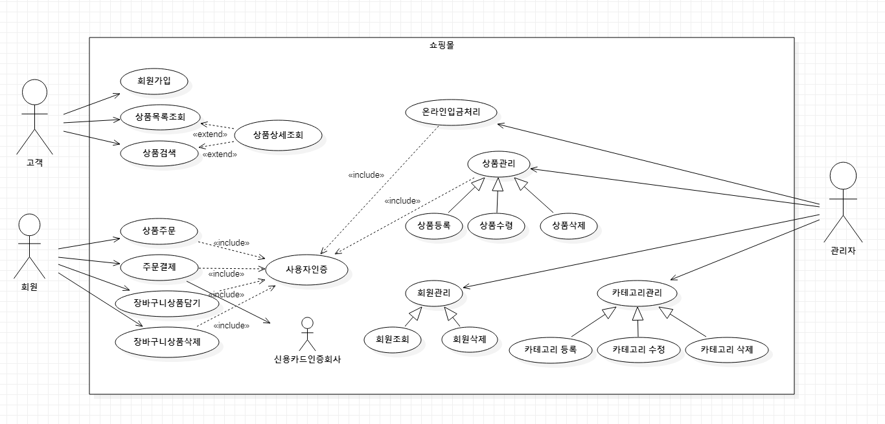

  

[메인으로 이동](../../README.md)

